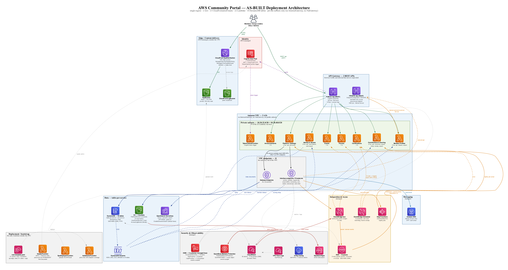

# AWS Community Portal

A serverless, event-driven community management platform built on AWS. Eight microservices (Python 3.12 on Lambda) behind API Gateway — a public REST API for the browser and a private REST API for internal service-to-service fan-out — with a React + Vite SPA, delivered as infrastructure-as-code via CloudFormation and AWS SAM. The service Lambdas run in private subnets with no internet route and reach every AWS service through VPC endpoints.

## Table of Contents

- [Overview](#overview)
- [Architecture](#architecture)
- [Services](#services)
- [Tech Stack](#tech-stack)
- [Repository Layout](#repository-layout)
- [Prerequisites](#prerequisites)
- [Getting Started](#getting-started)
- [Running Locally](#running-locally)
- [Testing](#testing)
- [Deployment](#deployment)
- [Configuration](#configuration)
- [Security](#security)
- [Contributing](#contributing)

## Overview

The AWS Community Portal enables community managers to coordinate members, events, certifications, forums, contributions tracking, and announcements through a unified platform.

**Key capabilities:**

- Authentication and RBAC (4 roles: Administrator, Community Leader, User Group Leader, Member)
- User group management with join/leave workflows and soft-delete lifecycle
- Event and meetup scheduling with RSVP, attendance tracking, and materials
- Discussion forums with channels, threads, reactions, and moderation
- Certification tracking with auto-award on qualifying evidence
- Contributions scoring with an append-only point ledger, tiers, and leaderboards
- Announcements with scheduled publishing and rich content
- What's New feed (client-side RSS, configured via Settings)
- Platform settings, email templates, and admin tools

## Architecture

The diagram below is the **as-built** deployment view, regenerated directly from the CloudFormation templates in `infra/` (not from design intent). Regenerate it after any infra change with `python3 aidlc-docs/inception/application-design/deployment_diagram.py` (needs `pip install diagrams` and Graphviz `dot`).



Text summary of the request path and the async plane:

```
                         Members / Leaders / UGLs / Admins
                            │                        │
                    HTTPS (SPA)                 REST /api (JWT)
                            ▼                        ▼
                 CloudFront ──OAI──▶ S3 (SPA)   Public API Gateway (REST)
                 (managed security-                 │  Cognito authorizer
                  headers; no WAF)                  │
                                                    ▼
   ┌─────────────────── VPC (2 AZs, private subnets only, no IGW/NAT) ───────────────────┐
   │  19 Lambdas: IAM · MEM · EVT · FOR · CRT · CON · ANN · SET  (+ TokenClaims trigger)  │
   │        │                                             ▲                                │
   │   VPC endpoints (S3, DynamoDB gateway; events,       │ internal fan-out               │
   │   lambda, cognito, SES, cloudwatch, ssm, states,     └── Private API Gateway (REST)   │
   │   execute-api, aoss interface) — the only way out                                     │
   └───────┬─────────────────────┬─────────────────────┬──────────────────────────────────┘
           ▼                     ▼                     ▼
   DynamoDB (18 tables,     EventBridge bus +     Step Functions
   SSE-KMS CMK, PITR)       Scheduler (13 rules)  (nightly jobs)
           │                     │
     DynamoDB Streams        SQS + DLQ ─▶ consumers        S3 uploads ─▶ GuardDuty
     (CDC → indexers,        (8 queues, SSE-KMS)           malware scan ─▶ EventBridge
      scoring rollup)                    │
      │                                  ▼
      └─▶ OpenSearch Serverless    Amazon SES (auth/OTP email)
          (optional, gated on
           EnableSemanticSearch)
```

**Design principles:**

- One Lambda per service (Lambdalith with internal router)
- Table-per-service (no shared databases)
- AuthN at edge (Cognito); authZ in-service (fail-closed, from contract-defined permission matrix)
- Asynchronous domain events via EventBridge; DynamoDB Streams for CDC
- No shared runtime libraries (conventions copied per service)
- Contract-first: OpenAPI and JSON Schema in `contracts/` are the source of truth

## Services

| Service | Description |
|---------|-------------|
| identity-access | Users, groups, RBAC, Cognito sync, membership events |
| member-profiles | Profile CRUD, directory, skills |
| events | Event scheduling, RSVP, attendance, materials |
| forums | Channels, posts, replies, reactions, moderation, follows |
| certifications | Cert definitions, claims, auto-award |
| contributions-scoring | Point ledger, framework config, tiers, leaderboards |
| announcements | Scheduled announcements, rich content, dismissals |
| settings | Platform config, email templates, allowed domains |

## Tech Stack

| Layer | Technology |
|-------|-----------|
| Frontend | TypeScript, React 18, Vite 5, react-router-dom |
| Backend | Python 3.12, AWS Lambda (Lambdalith) |
| Database | Amazon DynamoDB (per-service tables, PITR, on-demand) |
| Auth | Amazon Cognito (user pool, custom-auth OTP triggers) |
| Events | Amazon EventBridge (bus + Scheduler), DynamoDB Streams, SQS + DLQ |
| Orchestration | AWS Step Functions (nightly jobs) |
| Email | Amazon SES |
| Storage | Amazon S3 (materials, file-share, exports, SPA hosting, access logs) |
| CDN | Amazon CloudFront (managed security-headers policy; no WAF — descoped) |
| Encryption | AWS KMS customer managed keys (DynamoDB, SQS, CloudWatch Logs) |
| Threat detection | Amazon GuardDuty Malware Protection (S3 uploads) |
| IaC | AWS CloudFormation + AWS SAM |
| Linting | ruff (Python), cfn-lint (CloudFormation) |
| Testing | pytest (backend), vitest (frontend) |

## Repository Layout

```
community-portal/
├── contracts/          # Source of truth: OpenAPI + event JSON Schema + RBAC spec
│   ├── services/       #   Per-service openapi.yaml + published-events/*.json
│   └── platform/       #   Event envelope, error response, role-permission matrix
├── services/           # One self-contained Python package per backend service
│   ├── identity-access/
│   ├── member-profiles/
│   ├── events/
│   ├── forums/
│   ├── certifications/
│   ├── contributions-scoring/
│   ├── announcements/
│   └── settings/
├── frontend/           # React + Vite SPA (TypeScript)
│   └── src/
│       ├── components/ #   Shared UI components
│       ├── features/   #   Feature-based page modules
│       ├── lib/        #   Utilities, API client, hooks
│       └── styles/     #   Global styles
├── infra/              # CloudFormation + SAM templates
│   ├── root-template.yaml
│   ├── foundation.yaml
│   ├── api-edge.yaml
│   ├── seed.yaml
│   ├── services/       #   Per-service -data and -app stacks
│   ├── pipelines/      #   CI/CD pipeline templates
│   └── tools/          #   deploy.sh, generators, live verifiers
├── platform/           # Delivery tooling
│   ├── reference/      #   Canonical conventions (logger, errors, authz, validation)
│   ├── build/          #   Dependency-complete packaging
│   └── seed/           #   Custom resource Lambdas for seeding
├── requirements/       # Original use-case specs + HTML mockups
├── dist/               # Prebuilt release artifacts
├── Makefile            # Developer and release entrypoints
├── pyproject.toml      # Shared dev tooling config (ruff, pytest, mypy)
└── service-mode.json   # Per-service status tracker
```

## Prerequisites

- **Python 3.12+**
- **Node.js 20+** (frontend)
- **AWS SAM CLI** (deployment)
- **AWS credentials** configured for the target account/region

## Getting Started

```bash
# 1. Clone the repository
git clone <repository-url>
cd community-portal

# 2. Install dev tooling
make bootstrap

# 3. Run all tests
make test

# 4. Lint
make lint
```

## Running Locally

```bash
# Start the frontend dev server (:5173, proxies /api → the configured API endpoint)
cd frontend && npm run dev
```

The SPA at `http://localhost:5173` runs against a deployed API endpoint (see [Deployment](#deployment)).

## Testing

### Backend (Python)

Each service runs in its own pytest process (services share top-level module names, so process isolation prevents import conflicts):

```bash
make test                              # All services + platform + frontend
python3 -m pytest services/events -q   # Single service
python3 -m pytest platform -q          # Platform tests only
```

### Frontend (TypeScript)

```bash
cd frontend && npm test
```

### Linting

```bash
make lint                              # ruff (Python) + cfn-lint (IaC)
```

## Deployment

### Deploy

The `infra/tools/deploy.sh` script handles the full deployment pipeline — stages the
built SPA into the seed package, packages Lambda code to S3, uploads the nested
CloudFormation templates, and deploys the root stack.

It does **not** build the frontend for you. Build first, then deploy: the script
refuses to run against a `dist/` that does not match `services/*/src`, which is what
stops a "successful" deploy from shipping the previous code.

```bash
# Build first
cd frontend && npm run build && cd ..
make build

# Default: deploys to us-east-1 as "community-portal-dev"
./infra/tools/deploy.sh

# Override region, stack name, or stage
REGION=eu-west-1 STACK=community-portal-prod STAGE=prod ./infra/tools/deploy.sh

# Stage and upload templates without deploying
TEMPLATES_ONLY=1 ./infra/tools/deploy.sh
```

Configuration is read from environment variables (all have defaults), not interactive prompts:

| Variable | Default | Description |
|----------|---------|-------------|
| `REGION` | us-east-1 | AWS region |
| `STACK` | community-portal-dev | CloudFormation stack name |
| `STAGE` | dev | Environment stage |
| `ADMIN_EMAIL` | (dev default) | Receives the bootstrap admin invitation and OTP verification — set to a real mailbox |
| `OPS_EMAIL` | (dev default) | Receives CloudWatch alarm notifications (SNS email subscription) |
| `ALLOWED_DOMAINS` | Comma-separated Cognito sign-up allow-list |
| `BUCKET` | community-portal-artifacts-{account}-{region} | S3 artifact bucket |
| `TEMPLATES_ONLY` | 0 | Stage and upload templates without deploying |

`EnableSemanticSearch` is passed as `false` by `deploy.sh`; enabling the optional OpenSearch resources means deploying the root template with that parameter set to `true`. (There is no `NAT_PER_AZ` knob — the VPC has no NAT Gateway.)

### What deploy.sh does

1. Builds the frontend SPA and stages it into the seed Lambda package
2. Creates the S3 artifacts bucket if it doesn't exist
3. Packages all Lambda code via `sam package` (rewrites CodeUri to S3 locations)
4. Uploads nested templates to S3
5. Deploys the root stack via `sam deploy` with all parameters

### Stack structure

The root template orchestrates 21 nested stacks:

1. **Keys** — KMS customer managed keys (DynamoDB, SQS, CloudWatch Logs)
2. **Foundation** — VPC (private subnets + endpoints, no IGW/NAT), Cognito user pool, EventBridge bus, S3 buckets, GuardDuty malware protection, VPC Flow Logs, ops SNS topic, OpenSearch (optional)
3. **ApiEdge** — public + private API Gateways, CloudFront distribution (no WAF), S3 SPA bucket
4. **Per-service** (×8) — each has a `-data` stack (DynamoDB tables) and `-app` stack (Lambda + integrations)
5. **Seed** — custom resource Lambda that provisions default data on first deploy

Data stacks use `DeletionPolicy: Retain` — redeploying the app never touches stored data.

### Post-deploy verification

```bash
# Confirm stack status
aws cloudformation describe-stacks --stack-name community-portal-dev --query "Stacks[0].StackStatus"

# Get endpoints (Portal URL + API URL)
aws cloudformation describe-stacks --stack-name community-portal-dev --query "Stacks[0].Outputs" --output table
```

The SPA reads `/config.json` (injected by the seed stack) for API endpoint and Cognito details — no frontend rebuild needed when endpoints change.

## Configuration

| File | Purpose |
|------|---------|
| `contracts/platform/permissions/role-permission-matrix.v1.json` | RBAC source of truth |
| `infra/root-template.yaml` | Top-level SAM template with deploy parameters |
| `pyproject.toml` | Shared ruff/pytest/mypy dev config |
| `frontend/package.json` | Frontend dependencies and scripts |
| `service-mode.json` | Per-service status tracker |

### SAM template parameters

Parameters exposed by the root template (`Stage`, `AdminEmail`, `OpsEmail`, `AllowedEmailDomains`, `EnableSemanticSearch`, `DeployNonce`, `TemplateBaseUrl`):

- `Stage` — environment stage
- `AdminEmail` / `OpsEmail` — bootstrap admin mailbox and ops-alarm recipient
- `AllowedEmailDomains` — Cognito sign-up allow-list
- `EnableSemanticSearch` — condition-gates the OpenSearch Serverless resources (default `false`)
- `DeployNonce` — changes each deploy to re-run the seed/SPA custom resources

## Security

- **AuthN**: Amazon Cognito with email + password sign-in and periodic OTP re-verification
- **AuthZ**: Four-role RBAC (no inheritance) enforced server-side; fail-closed
- **Edge**: Cognito authorizer on the public API Gateway; the private API is reachable only through its VPC endpoint. No WAF (descoped, AC-1)
- **Network**: Lambdas in private subnets with no InternetGateway or NatGateway; all AWS access is via VPC endpoints, so there is no route to the internet
- **Data**: Encryption at rest with KMS customer managed keys (DynamoDB, SQS, CloudWatch Logs) and SSE-S3 on buckets; TLS-only bucket policies and TLS in transit throughout
- **Uploads**: GuardDuty Malware Protection scans file-share uploads; a QUARANTINED verdict purges every object version
- **Secrets**: No standing admin secret — the seeder generates the admin password, sets it PERMANENT and discards it; the operator arrives via "Forgot password". Secrets Manager was removed
- **Audit**: Access audit logging (toggle, 12-month retention); S3 server access logs and VPC Flow Logs retained
- **IAM**: Per-Lambda roles scoped to their own table and the event bus
- **Input validation**: All request bodies validated against contract schemas
- **Error responses**: Generic messages only (no internal details leaked)

## Contributing

1. **Contracts first** — any new endpoint or event starts as a spec in `contracts/`.
2. **No cross-service imports** — services communicate only through contracts (REST or events).
3. **Tests** — add tests in `services/<svc>/tests/` alongside implementation; `make test` must pass.
4. **Lint clean** — `make lint` must pass (ruff + cfn-lint).
5. **Conventions** — follow `platform/reference/` patterns; don't introduce new shared libraries.

## License

See [LICENSE](LICENSE) for details.
