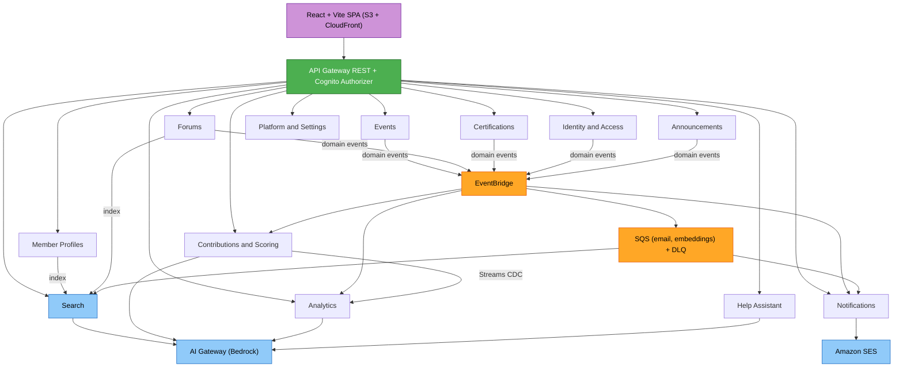

# Application Design — AWS Community Portal (Consolidated)

**Stage**: INCEPTION → Application Design. High-level component/service identification, interfaces, orchestration, and dependencies. Detailed business logic and data-key design are deferred to per-unit Functional Design (CONSTRUCTION).

**Companion docs**: `services.md` · `components.md` · `component-methods.md` · `component-dependency.md`.

## Confirmed design decisions
| # | Decision |
|---|---|
| Topology | **Microservices** — one service per bounded context (Q1=A) |
| Backend language | **Polyglot** — Python, Node.js, or Rust; specific language per service decided at Construction (Code Generation) |
| Backend layout | **Polyglot monorepo** — per-service package (lambda handlers) + shared libraries per language (Q2=A) |
| API | **Single API Gateway (REST)**, per-module resource paths → per-service Lambdas (Q3=A) |
| Compute | **One Lambda per service** ("Lambdalith"), internal router (Q4=A) |
| Data | **Table-per-service** (each service owns its DynamoDB table[s]) (Q5=B) |
| Eventing | **DynamoDB Streams + EventBridge + SQS** (Q6=A) |
| AuthN/Z | **Cognito authorizer** (authN) + **shared authZ library** (per-language implementation) in every handler (Q7=A) |
| Frontend | **Single React+Vite SPA**, feature-folders, shared design system, role-aware (Q8=A) |
| Shared | Auth/RBAC, Notifications, Search (OpenSearch), AI Gateway (Bedrock), Audit, File-share, common domain/persistence (Q9=A) |
| Platform | Polyglot Lambda — Python (`python3.x`), Node.js (`nodejs20.x`), or Rust (`provided.al2023`) per service · CloudFormation + SAM · S3+CloudFront SPA · single-region multi-AZ · Backup & Restore · Security + Resiliency baselines |

## Overview
A serverless, event-driven microservices architecture. The React SPA (S3+CloudFront) calls a single API Gateway REST endpoint; a Cognito authorizer authenticates, and each request is authorized server-side by the shared `auth` library against the Role-and-Permission-Mapping. Each bounded context is an independently deployable Lambda (implemented in Python, Node.js, or Rust — language chosen per service at Construction) that owns its DynamoDB table(s). Services collaborate mainly through **asynchronous domain events (EventBridge)**; **DynamoDB Streams** drive per-service rollups and the Search/Analytics projections; **SQS** buffers durable async work (SES email, embeddings). Amazon Bedrock is fronted by a shared AI Gateway; semantic search uses Amazon OpenSearch Serverless vector indices.

## Components and Interfaces
Services (11 bounded contexts + shared + edge): Identity & Access · Member Profiles & Directory · Events · Forums · Certifications · Contributions & Scoring · Analytics · Announcements · Notifications · Platform/Settings · Help Assistant — plus shared **Search** and **AI Gateway** services, **Notifications** as an event sink, cross-cutting **Audit**, and the **API Gateway** edge. What's New (Module 11) is a **frontend-only** feature (client-side RSS) configured via Settings.

Interfaces and component detail live in the companion docs: service definitions/orchestration + published/consumed events in `services.md`; internal component archetypes in `components.md`; method signatures/interface contracts in `component-methods.md`; dependencies + communication patterns in `component-dependency.md`; per-requirement data flows in `data-flows.md`.

## Architecture

## Deployment Architecture
**As-built** deployment view, regenerated from the CloudFormation templates in `infra/` rather than from the original design intent (single region, 2 AZs, VPC-attached compute). Rendered with official AWS icons by `deployment_diagram.py` in this directory — re-run `python3 deployment_diagram.py` (needs `pip install diagrams` and Graphviz `dot`) after any infra change.

The system is **8 microservices** (identity-access, member-profiles, events, forums, certifications, contributions-scoring, announcements, settings) across **21 CloudFormation stacks**, deploying **22 Lambdas** (19 in the VPC private subnets, plus 3 bootstrap functions outside it) over **18 DynamoDB tables**. Service Lambdas reach every AWS-managed service **only through VPC endpoints**: the VPC has no InternetGateway and no NatGateway (both removed for appsec clearance, ~2026-08-30), so there is no route to the internet. CloudFront/S3-SPA, both API Gateways, and Cognito sit outside the customer VPC.

Note the drift this diagram corrects versus earlier revisions: there is **no WAF** (descoped, AC-1), **no NAT/public subnets**, **no Secrets Manager** (the seeder generates and discards the admin password), and **no Bedrock** (semantic search via OpenSearch Serverless is optional and gated on `EnableSemanticSearch`, default `false`). Added since: a second **private REST API** for internal service-to-service fan-out, **Step Functions** for nightly jobs, three **KMS customer managed keys**, **GuardDuty** malware protection on the file-share bucket, and **VPC Flow Logs**.

## Data Models
High-level ownership only; concrete key/GSI design is per-unit Functional/Infrastructure Design. **Table-per-service** (each service owns its DynamoDB table[s]); no shared database.
- **Identity & Access**: Users/portal-records, Groups, Membership-events (append-only, US-1.34), Join-requests. (No local-admin secret: the seeder generates the admin password, sets it PERMANENT and discards it; the operator arrives via "Forgot password" — Secrets Manager was removed.)
- **Member Profiles**: Member-profile (identity read-only from Cognito) + OpenSearch vectors.
- **Events**: Events, RSVPs, Materials metadata (files in S3), Upload-links.
- **Forums**: Forums/Channels/Posts/Replies, Reactions, Follows, Reports (+ OpenSearch vectors).
- **Certifications**: Certifications (per-cert points), Claims.
- **Contributions & Scoring**: **append-only point ledger** (system of record), Framework config, Submissions, derived Rollups.
- **Analytics**: read-model projections + rollups in a separate analytics store (choice deferred).
- **Announcements**: Announcements, per-member Dismissals.
- **Notifications**: In-portal notifications, Preferences.
- **Platform/Settings**: Settings, Email-templates, File-share links.
Balances/tiers are always derived at runtime from the ledger (never stored authoritatively). Concurrency: last-write-wins.

## Mapping to AWS (elaborated in Infrastructure Design)
- Compute: Lambda, one per service, polyglot runtime per service (`python3.x`, `nodejs20.x`, or Rust `provided.al2023` — decided at Construction). Edge: API Gateway REST + Cognito authorizer; CloudFront + S3 for SPA (WAF + security headers).
- Data: DynamoDB (table-per-service, PITR + on-demand backups); OpenSearch Serverless (vectors); S3 (materials, file-share, exports); separate analytics store (choice deferred).
- Integration: EventBridge (domain events), SQS+DLQ (durable async), DynamoDB Streams (CDC). Email: SES. AI: Bedrock (via AI Gateway). Identity: Cognito user pool (custom-auth OTP triggers). Secrets: Secrets Manager (local admin). Scheduling: EventBridge Scheduler (sync job, cert expiry, daily insights).
- Observability/Security: CloudWatch logs/metrics/alarms, X-Ray tracing for multi-service flows; least-privilege IAM per Lambda; encryption at rest/in transit.

## Alignment to requirements & baselines
- **RBAC** enforced server-side per Role-and-Permission-Mapping (US-1.12, SECURITY-08).
- **Scoring** integrity: Contributions is the sole ledger writer; tiers computed at runtime; rollups are derived caches (US-6.12, B8).
- **Notifications** honor the US-8.15 recipient matrix + preferences.
- **Security baseline (15)** and **Resiliency baseline (15)** are cross-cutting constraints; per-unit compliance evaluated in NFR/Infrastructure Design.

## Correctness Properties

### Property 1: RBAC fail-closed
No action succeeds without a passing server-side authorization check (deny → 403); object-level checks prevent IDOR (SECURITY-08).
**Validates: Requirements 1.12**

### Property 2: Ledger immutability
Points are only ever appended; balances/tiers are pure functions of ledger + framework and are never stored authoritatively.
**Validates: Requirements 6.1, 6.12**

### Property 3: Equal-split exactness
Community-wide point distributions sum exactly to the source value across the member's groups (deterministic remainder allocation).
**Validates: Requirements 6.3, 6.17, 6.18**

### Property 4: Runtime tiers
Tiers recompute deterministically from the ledger for any group/quarter, including late-quarter entries (never frozen).
**Validates: Requirements 6.12**

### Property 5: Notification correctness
Recipients equal the US-8.15 matrix ∩ preferences; leaders never receive member-only categories; Administrators receive only transactional emails.
**Validates: Requirements 8.2, 8.6, 8.15**

### Property 6: Idempotent consumers
Event consumers (auto-award, projections, indexing) are idempotent under at-least-once delivery/retries.
**Validates: Requirements 6.12**

### Property 7: Search consistency
Deleted content is removed from the index (not searchable); deactivated members remain searchable with an inactive badge.
**Validates: Requirements 3.5, 4.13**

## Error Handling
- Global fail-closed error handling in every Lambda; generic user-facing messages (no internals, SECURITY-15).
- External calls (Cognito, Bedrock, SES, MS Teams, DynamoDB, OpenSearch) have explicit timeouts + graceful degradation (RESILIENCY-10): AI insights show stale-with-timestamp; duplicate detection fails closed (rejects) per requirement; mention autocomplete degrades to no-suggestions.
- Durable async (SES email, embeddings) uses SQS with retry/backoff and DLQs; failed emails discarded after 3 retries/15 min (per NFR).
- Cross-service consistency is eventual; last-write-wins for concurrent edits (no optimistic locking Phase 1).

## Testing Strategy
- **Unit**: domain logic (tier calc, equal-split, RBAC matrix, quarter attribution) as pure-function tests.
- **Integration**: per-service handler + DynamoDB (local/emulated) + event publish/consume; RBAC allow/deny per role.
- **Contract**: EventBridge domain-event schemas (producer/consumer) and REST request/response shapes.
- **End-to-end (key flows)**: attendance→points→tier→notify; forum post→dedup→index→award; certification approval→points; group hard-delete cascade.
- **Property-based testing is out of scope** (extension disabled). Detailed test plans are produced in Build and Test.

## Open items carried to design (from readiness assessment)
Data key design (per service), analytics store choice, embedding model, Bedrock model/RAG + AI reporting guardrails, Cognito custom-auth internals, file-share S3 mechanism, rollup idempotency/late-quarter recompute, cross-service event contracts/versioning. These are per-unit Functional/NFR/Infrastructure Design inputs.
