# Data Flow Design — AWS Community Portal

Component-to-component **data flows as sequence diagrams**, grouped by service, plus a use-case ↔ flow **traceability matrix**. Companion: `application-design.md`, `services.md`, `components.md`, `component-methods.md`, `component-dependency.md`.

## How to read the diagrams
- Solid arrow `→` = synchronous request; dashed arrow `⇠` = response.
- Notes labelled **[E]** EventBridge domain event · **[C]** DynamoDB Streams CDC · **[Q]** SQS durable async.
- **DDB** = the calling service's own DynamoDB table(s) (table-per-service). Reads/writes to a service's system-of-record are shown as explicit `Service→DDB` interactions; the Contributions point ledger is append-only. Pure in-memory logic (tier calc, matching, aggregation) remains a service self-call. Client-only state (e.g., SPA table preferences) is not a DDB write.
- Every client call implicitly passes `SPA → CloudFront → API Gateway (Cognito authorizer) → Service (Router → AuthZ guard, fail-closed)`. Diagrams start at API Gateway (**GW**) for brevity.
- Participant codes: **U**=User/SPA, **GW**=API Gateway, services: IAM, MEM, EVT, FOR, CERT, CON, ANA, NOT, SET, HELP, ANN, SRCH(Search), AIG(AI Gateway); infra: COG(Cognito), EB(EventBridge), SQS, SES, DDB(service table), S3, OS(OpenSearch), SM(Secrets Manager), TEAMS(MS Teams), SCHED(EventBridge Scheduler), BR(Bedrock).

**Flow IDs**: `DF-<SERVICE>-NN`.

---

# 1. Identity & Access Service (Module 1)

### DF-IAM-01 — Community sign-in, OTP re-verification, logout, reset — US-1.2, US-1.32, US-1.3, US-1.20
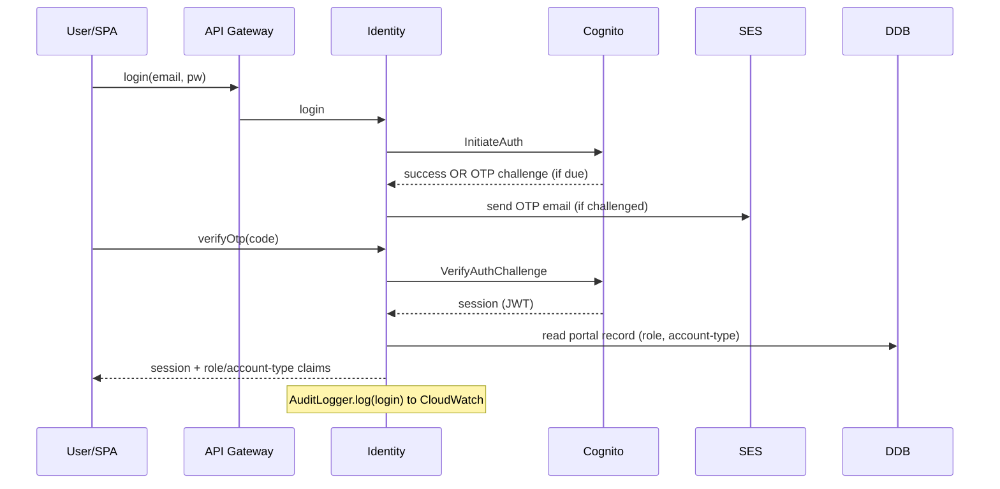

### DF-IAM-02 — Built-in local Administrator sign-in & reset — US-1.27, US-1.28
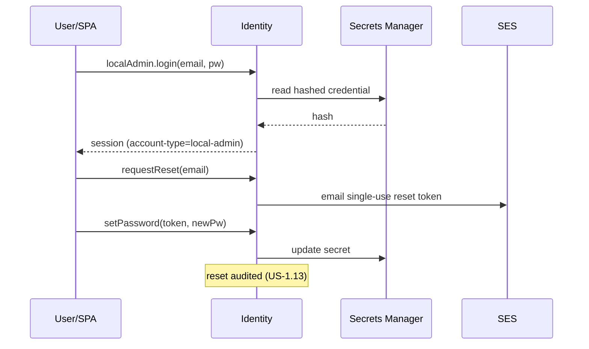

### DF-IAM-03 — Onboarding & provisioning (JIT, self-register, sync, bulk import) — US-1.15, US-1.30, US-1.4, US-1.31
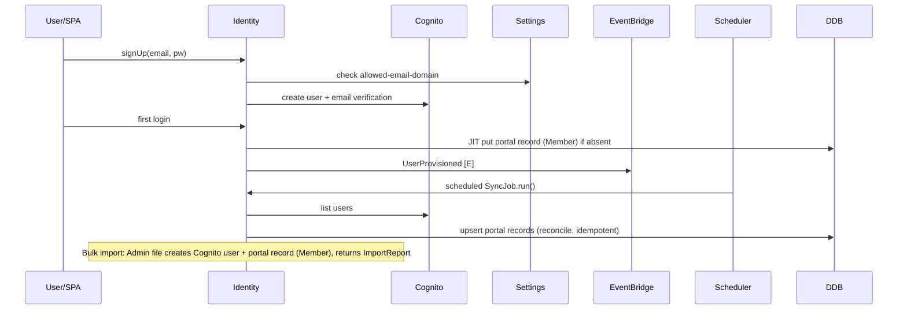

### DF-IAM-04 — Edit user (role & group), role change, disable/enable — US-1.26, US-1.5, US-1.33, US-1.6, US-1.19
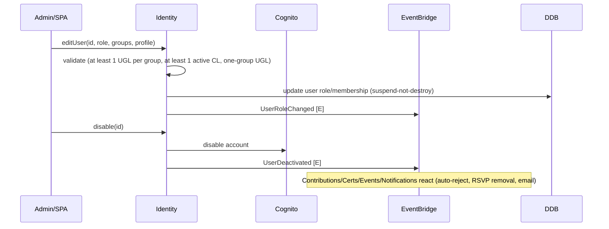

### DF-IAM-05 — User group lifecycle (create/edit/soft-delete/restore/hard-delete, directory) — US-1.7, US-1.18, US-1.11, US-1.16
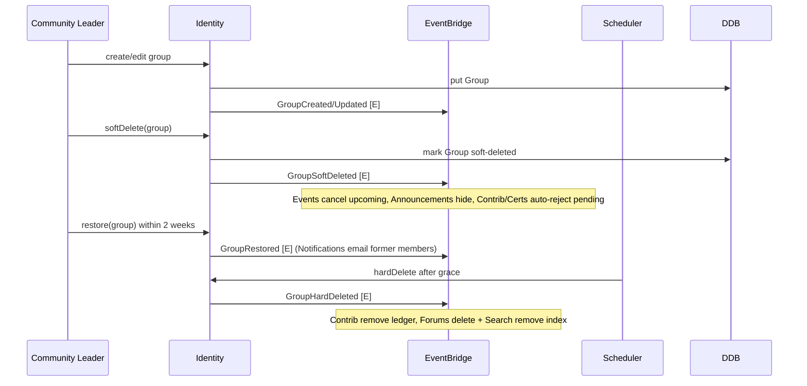

### DF-IAM-06 — Group membership (join/leave/remove, join-requests, UGL assign) + history — US-1.8, US-1.9, US-1.10, US-1.17, US-1.21, US-1.34
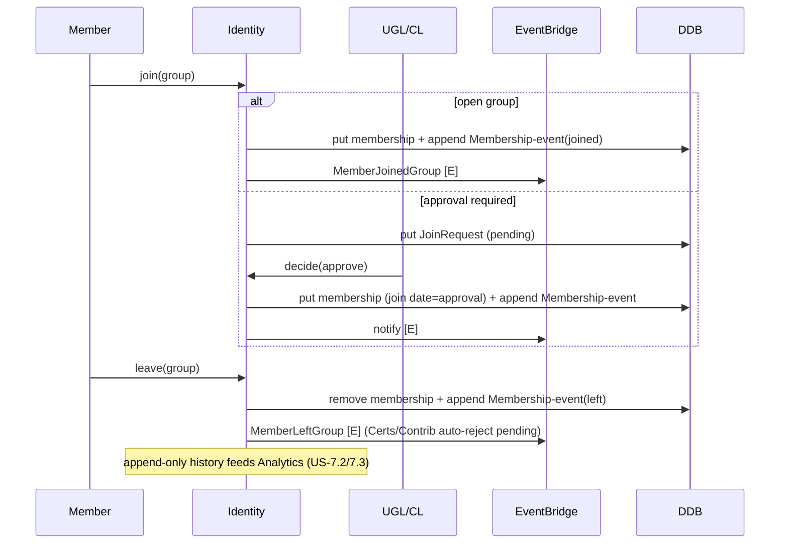

### DF-IAM-07 — RBAC enforcement (cross-cutting) — US-1.12
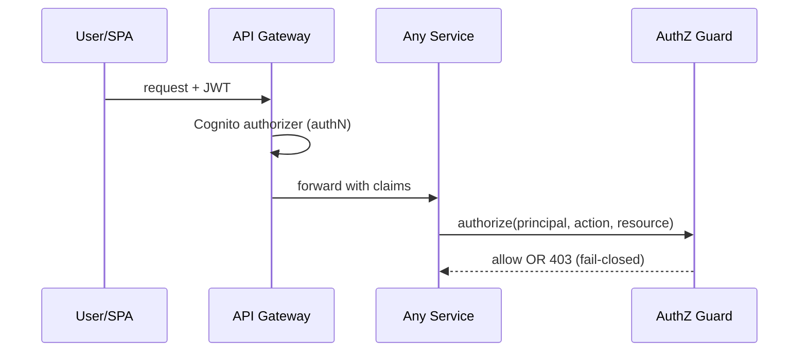

### DF-IAM-08 — Audit logging & toggle — US-1.13, US-1.14
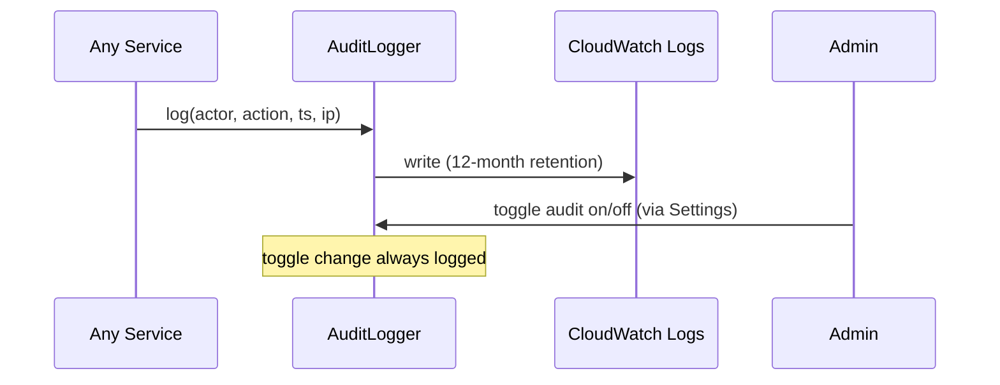

---

# 2. Member Profiles & Directory Service (Module 3)

### DF-MEM-01 — View/edit own profile — US-3.1, US-3.2
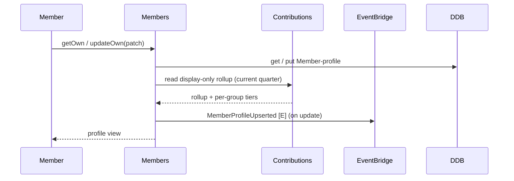

### DF-MEM-02 — View another profile / browse directory — US-3.3, US-3.4
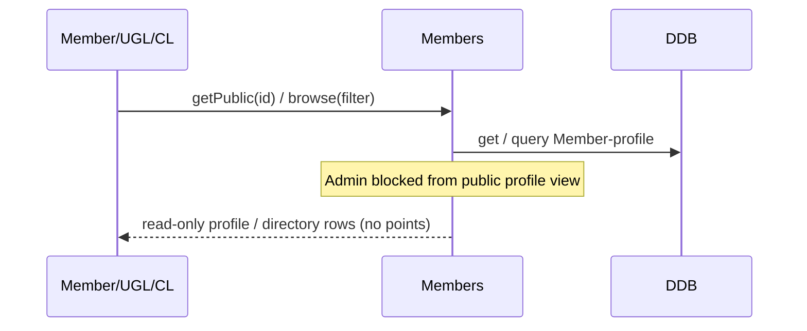

### DF-MEM-03 — Semantic member search (+ indexing) — US-3.5
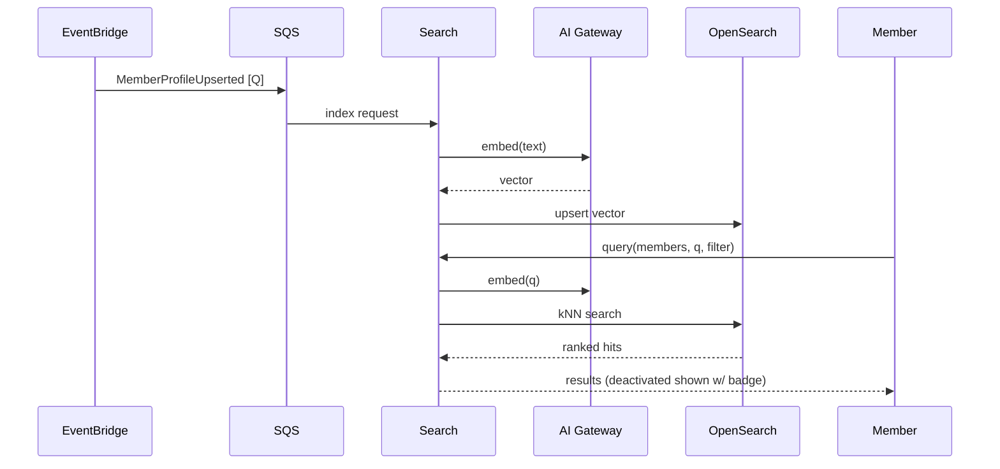

### DF-MEM-04 — Onboarding & welcome — US-3.6, US-3.7
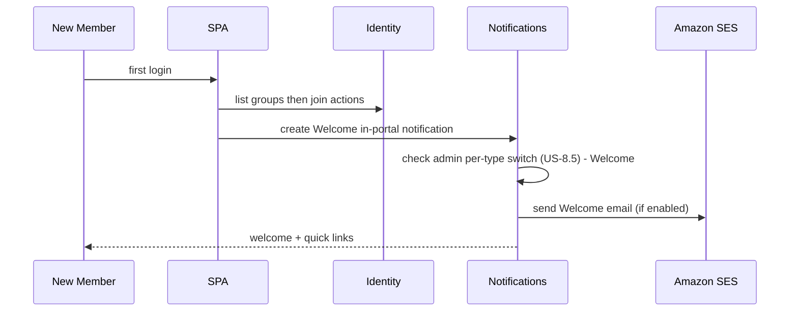

### DF-MEM-05 — Admin member list & export — US-3.8, US-3.9
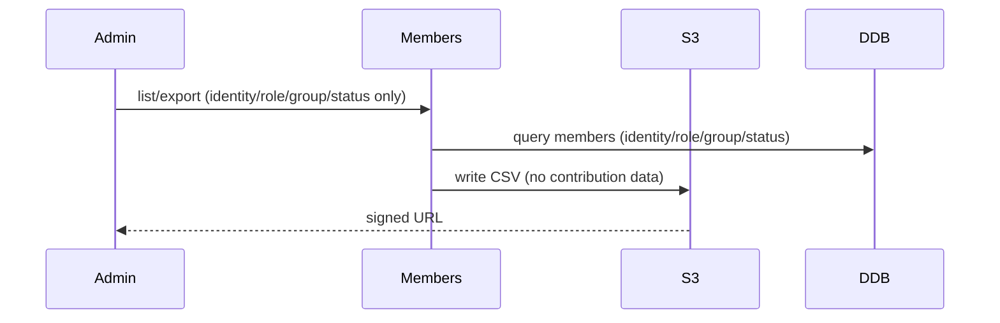

### DF-MEM-06 — Member activity summary — US-3.10
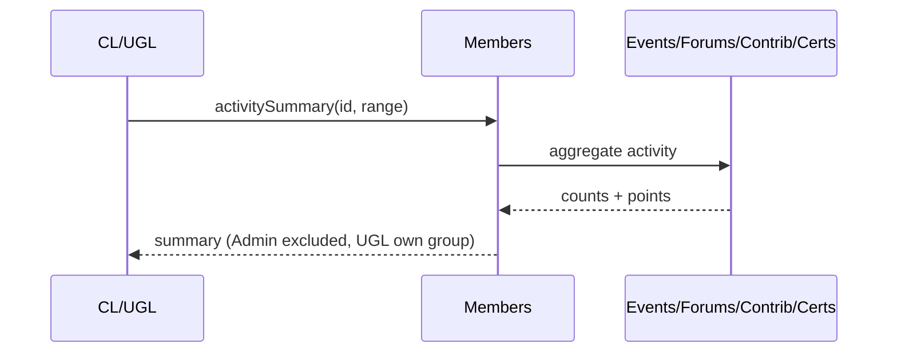

---

# 3. Events Service (Module 2)

### DF-EVT-01 — Create/edit/cancel/complete event (+ optional announcement) — US-2.1, US-2.4, US-2.5, US-2.19
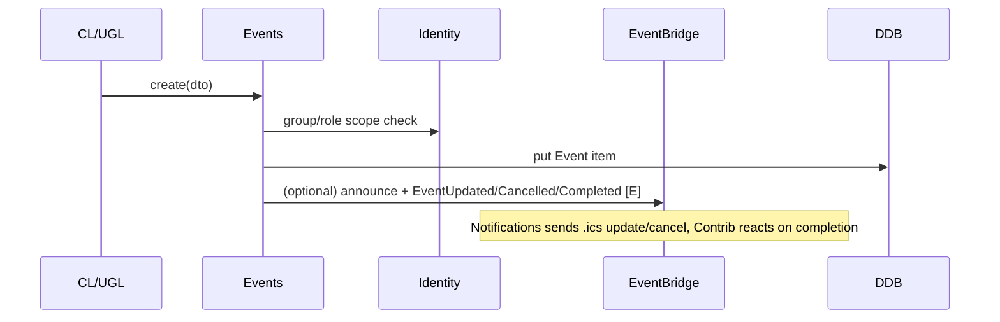

### DF-EVT-02 — Recurring series to occurrences — US-2.3
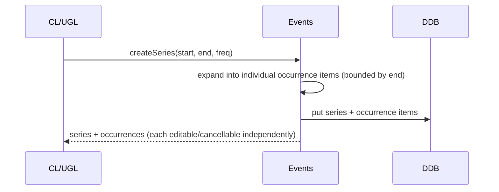

### DF-EVT-03 — Reminder config & send — **REMOVED (2026-08-27)**
US-2.2 and US-2.10 were descoped, so there is no scheduler, no due-record sweep and no
`EventReminderDue`. The member's own calendar entry, created by DF-EVT-04's .ics invite,
raises the reminder instead. The flow number is retained so DF-EVT-04 onward keep their IDs.

### DF-EVT-04 — RSVP + calendar invite — US-2.6, US-2.7, US-2.8
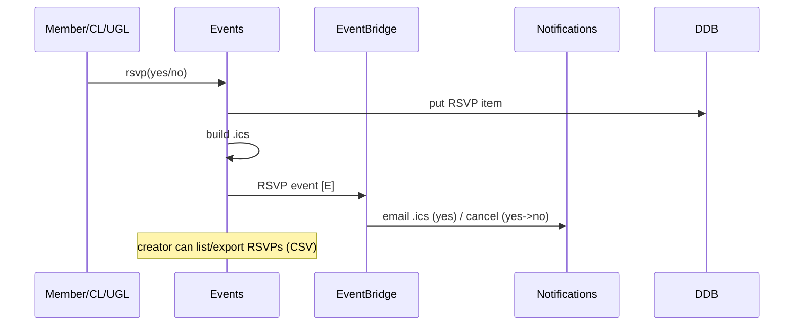

### DF-EVT-05 — Browse / detail / calendar — US-2.9, US-2.13, US-2.14
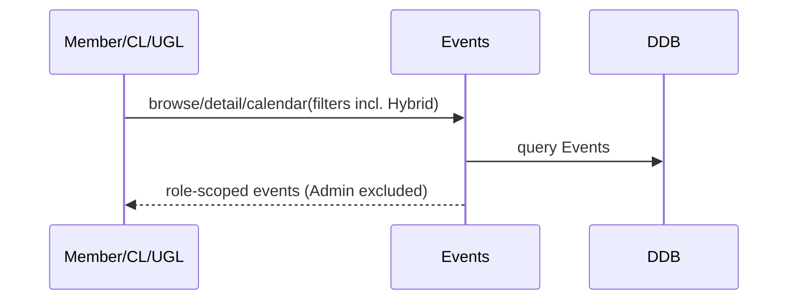

### DF-EVT-06 — Event materials — US-2.15
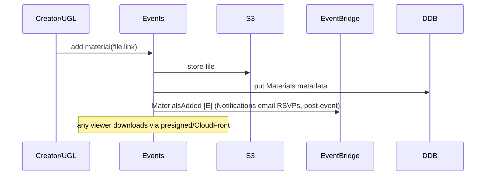

### DF-EVT-07 — MS Teams config & attendance — US-2.11, US-2.12
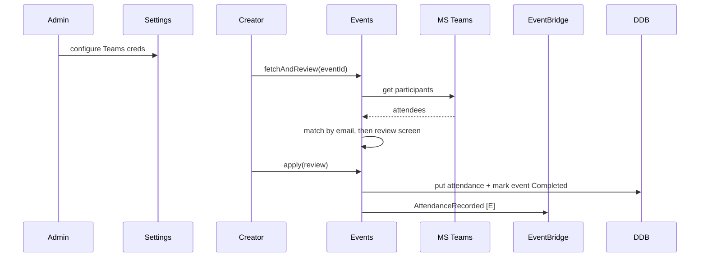

### DF-EVT-08 — Manual attendance & event points — US-2.16, US-2.17
```mermaid
sequenceDiagram
    participant C as Creator
    participant EVT as Events
    participant CON as Contributions
    participant EB as EventBridge
    C->>EVT: record(entries|CSV)
    EVT->>EVT: match emails
    EVT->>DDB: put attendance, set Completed
    EVT->>EB: AttendanceRecorded [E]
    Note over CON: point value read from framework, creator cannot override
```

### DF-EVT-09 — Presenter/organizer designation to points — US-2.18
```mermaid
sequenceDiagram
    participant C as Creator
    participant EVT as Events
    participant EB as EventBridge
    participant CON as Contributions
    C->>EVT: setDesignations(presenters[], organizers[])
    EVT->>DDB: put presenter/organizer designations
    EVT->>EB: EventDelivered + EventOrganized [E] (on completion)
    EB->>CON: auto-award (Member-only)
```

### DF-EVT-10 — Content Library — US-2.20
```mermaid
sequenceDiagram
    participant U as Member/CL/UGL
    participant EVT as Events
    participant S3 as S3
    U->>EVT: search(q, filters)
    EVT->>DDB: query completed-event materials metadata
    EVT->>EVT: keyword match over title/desc (scope-checked)
    EVT->>S3: open/download content
    EVT-->>U: results
```

### DF-EVT-11 — Event-scoped external upload link — US-2.21
```mermaid
sequenceDiagram
    participant C as Creator/UGL
    participant EVT as Events
    participant S3 as S3
    participant X as External uploader
    C->>EVT: createUploadLink(expiry, maxSize)
    EVT->>DDB: put Upload-link (token, expiry, maxSize)
    EVT->>S3: create folder prefix + token
    EVT-->>C: shareable link
    X->>EVT: open link, request upload
    EVT->>S3: write-only presigned PUT (per file)
    Note over EVT: owner views/downloads, revoke/expiry, audited
```

---

# 4. Forums Service (Module 4)

### DF-FOR-01 — Forum & channel management — US-4.1, US-4.2, US-4.3, US-4.4
```mermaid
sequenceDiagram
    participant L as CL/UGL
    participant FOR as Forums
    participant EB as EventBridge
    participant SRCH as Search
    L->>FOR: create/edit/delete forum|channel (scope-checked)
    FOR->>DDB: put Forum + default General channel
    FOR->>EB: ForumChannelDeleted [E] (on delete)
    EB->>SRCH: remove index entries
```

### DF-FOR-02 — Create post (+ dup detection + index + points) — US-4.5
```mermaid
sequenceDiagram
    participant M as Member/leader
    participant FOR as Forums
    participant AIG as AI Gateway
    participant EB as EventBridge
    participant SRCH as Search
    participant CON as Contributions
    M->>FOR: create post(title, body, <=5 images)
    FOR->>AIG: detectDuplicate (if enabled)
    AIG-->>FOR: result (fail-closed on error)
    FOR->>DDB: put Post (or hold if flagged)
    FOR->>EB: ForumPostCreated [E]
    EB->>SRCH: index (embed)
    EB->>CON: auto-award (author Member-only)
```

### DF-FOR-03 — Reply to post — US-4.6
```mermaid
sequenceDiagram
    participant M as Member
    participant FOR as Forums
    participant EB as EventBridge
    participant CON as Contributions
    participant NOT as Notifications
    M->>FOR: reply(body)
    FOR->>DDB: put Reply
    FOR->>EB: ForumReplyCreated [E]
    EB->>CON: auto-award (Member-only)
    EB->>NOT: notify original author
```

### DF-FOR-04 — Edit / delete post or reply — US-4.7, US-4.8
```mermaid
sequenceDiagram
    participant U as Author/Leader
    participant FOR as Forums
    participant EB as EventBridge
    participant SRCH as Search
    U->>FOR: editOwn (edited flag) / delete
    FOR->>DDB: update (edited) / delete Post|Reply
    FOR->>EB: PostDeleted [E] (points retained)
    EB->>SRCH: remove index entry
```

### DF-FOR-05 — @mention + notification — US-4.9, US-4.10
```mermaid
sequenceDiagram
    participant SPA as SPA
    participant FOR as Forums
    participant IAM as Identity
    participant EB as EventBridge
    participant NOT as Notifications
    SPA->>FOR: mention suggest(postId, q)
    FOR->>IAM: access-scope check (group members + UGL + CL)
    FOR-->>SPA: eligible candidates only
    FOR->>EB: MemberMentioned [E] (on save)
    EB->>NOT: email + in-portal
```

### DF-FOR-06 — Reactions — US-4.11
```mermaid
sequenceDiagram
    participant M as Member
    participant FOR as Forums
    M->>FOR: toggle reaction(kind)
    FOR->>DDB: put/delete Reaction
    FOR-->>M: updated counts
```

### DF-FOR-07 — Browse forums & channel post list — US-4.12, US-4.18
```mermaid
sequenceDiagram
    participant U as Participant
    participant FOR as Forums
    U->>FOR: browse / channel post list (role-scoped)
    FOR->>DDB: query Forums/Channels/Posts
    FOR-->>U: forums, channels, posts (sort/pin/pagination, US-8.9)
    U->>FOR: open post, view thread
```

### DF-FOR-08 — Semantic forum search — US-4.13
```mermaid
sequenceDiagram
    participant M as Member
    participant FOR as Forums
    participant SRCH as Search
    participant OS as OpenSearch
    M->>FOR: search(q, filter)
    FOR->>SRCH: query(forum, q)
    SRCH->>OS: kNN (deleted content absent)
    OS-->>SRCH: ranked hits
    SRCH-->>M: results (deactivated authors w/ badge)
```

### DF-FOR-09 — Pin / unpin — US-4.14
```mermaid
sequenceDiagram
    participant L as CL/UGL
    participant FOR as Forums
    L->>FOR: pin/unpin (scope-checked)
    FOR->>DDB: update pinned flag
    FOR-->>L: pinned flag (no notification)
```

### DF-FOR-10 — Accepted answer — US-4.15
```mermaid
sequenceDiagram
    participant U as Author/Leader
    participant FOR as Forums
    U->>FOR: mark accepted(replyId)
    FOR->>DDB: set single accepted (clears previous, no points)
    FOR-->>U: updated thread
```

### DF-FOR-11 — Follow channel/post — US-4.16
```mermaid
sequenceDiagram
    participant U as Participant
    participant FOR as Forums
    participant EB as EventBridge
    participant NOT as Notifications
    U->>FOR: follow/unfollow
    FOR->>DDB: put/delete Follow
    FOR->>EB: new activity on followed item [E]
    EB->>NOT: in-portal (email per prefs)
```

### DF-FOR-12 — Report & moderation — US-4.17
```mermaid
sequenceDiagram
    participant M as Member
    participant FOR as Forums
    participant L as UGL/CL
    M->>FOR: report(content, reason?)
    FOR->>DDB: put Report (route to group UGL + CLs queue)
    L->>FOR: dismiss / delete (US-4.8)
```

---

# 5. Certifications Service (Module 5)

### DF-CERT-01 — Definition management — US-5.1, US-5.2, US-5.3
```mermaid
sequenceDiagram
    participant CL as Community Leader
    participant CERT as Certifications
    CL->>CERT: create/edit/deactivate(name, category, badge, expiry, points)
    CERT->>DDB: put Certification definition (per-cert point value)
    CERT-->>CL: certification
```

### DF-CERT-02 — Claim submit / view / withdraw — US-5.4, US-5.5
```mermaid
sequenceDiagram
    participant M as Member
    participant CERT as Certifications
    M->>CERT: submit(cert, creditedGroup, evidence)
    CERT->>CERT: group-member + duplicate guard
    CERT->>DDB: put Claim (Pending)
    M->>CERT: listOwn / withdraw (Pending only)
    CERT->>DDB: query / update Claims
    CERT-->>M: claim status
```

### DF-CERT-03 — Verification (credited-group) to points — US-5.6, US-5.7
```mermaid
sequenceDiagram
    participant L as CL/UGL
    participant CERT as Certifications
    participant EB as EventBridge
    participant CON as Contributions
    participant NOT as Notifications
    L->>CERT: list queue (UGL: claims credited to led group)
    CERT->>DDB: query pending Claims (credited group)
    L->>CERT: decide(approve/reject, reason)
    CERT->>DDB: update Claim status
    CERT->>EB: CertificationApproved (per-cert points, credited group) [E]
    EB->>CON: auto-award
    CERT->>NOT: notify member
```

### DF-CERT-04 — Revoke — US-5.8
```mermaid
sequenceDiagram
    participant CL as Community Leader
    participant CERT as Certifications
    participant EB as EventBridge
    participant NOT as Notifications
    CL->>CERT: revoke(member, reason)
    CERT->>DDB: update Claim revoked (remove badge, points retained)
    CERT->>EB: CertificationRevoked [E]
    EB->>NOT: notify member
```

### DF-CERT-05 — Expiry (scheduled) — US-5.1 (expiry)
```mermaid
sequenceDiagram
    participant SCHED as Scheduler
    participant CERT as Certifications
    participant NOT as Notifications
    SCHED->>CERT: runDaily
    CERT->>DDB: query Claims nearing/at expiry
    CERT->>NOT: notify 2 weeks before expiry
    CERT->>DDB: mark expired (remove badge, points retained)
    CERT->>NOT: notify expired
```

### DF-CERT-06 — Badges & catalog — US-5.9, US-5.10
```mermaid
sequenceDiagram
    participant M as Member
    participant CERT as Certifications
    participant MEM as Members
    M->>CERT: browse catalog (active, held indicators)
    CERT->>DDB: query Certifications + Claims
    MEM->>CERT: read earned badges (for profile)
    CERT-->>M: catalog + badges
```

---

# 6. Contributions & Scoring Service (Module 6)

### DF-CON-01 — Scoring framework configuration — US-6.1, US-6.2
```mermaid
sequenceDiagram
    participant CL as Community Leader
    participant CON as Contributions
    CL->>CON: get/update framework
    CON->>CON: enforce fixed 6 auto set + evidence rules + tier thresholds
    CON->>DDB: get / put Framework config
    CON-->>CL: framework (seeded defaults)
```

### DF-CON-02 — Auto-award: event attendance — US-6.3
```mermaid
sequenceDiagram
    participant EB as EventBridge
    participant CON as Contributions
    EB->>CON: AttendanceRecorded [E]
    CON->>CON: Member-only check
    CON->>DDB: append ledger entry (group / equal-split)
    CON->>EB: PointsAwarded [E]
```

### DF-CON-03 — Auto-award: event delivery — US-6.17
```mermaid
sequenceDiagram
    participant EB as EventBridge
    participant CON as Contributions
    EB->>CON: EventDelivered [E]
    CON->>CON: Member-only presenters check
    CON->>DDB: append ledger entry (per-event-type delivery value)
    CON->>EB: PointsAwarded [E]
```

### DF-CON-04 — Auto-award: event organizing — US-6.18
```mermaid
sequenceDiagram
    participant EB as EventBridge
    participant CON as Contributions
    EB->>CON: EventOrganized [E]
    CON->>CON: Member-only organizers check
    CON->>DDB: append ledger entry (single organize value)
    CON->>EB: PointsAwarded [E]
```

### DF-CON-05 — Auto-award: forum activity — US-6.4
```mermaid
sequenceDiagram
    participant EB as EventBridge
    participant CON as Contributions
    EB->>CON: ForumPostCreated / ForumReplyCreated [E]
    CON->>CON: author Member-only check
    CON->>DDB: append ledger entry (forum's group)
    CON->>EB: PointsAwarded [E]
```

### DF-CON-06 — Auto-award: certification approved — US-6.5
```mermaid
sequenceDiagram
    participant EB as EventBridge
    participant CON as Contributions
    EB->>CON: CertificationApproved [E]
    CON->>DDB: append ledger entry (per-cert points, credited group)
    CON->>EB: PointsAwarded [E]
```

### DF-CON-07 — Evidence submission & approval — US-6.6, US-6.7, US-6.8, US-6.9
```mermaid
sequenceDiagram
    participant M as Member
    participant CON as Contributions
    participant L as CL/UGL
    participant NOT as Notifications
    M->>CON: submit(activity, group, evidence)
    CON->>CON: group-member check
    CON->>DDB: put Submission (Pending)
    L->>CON: listPending / decide(approve/reject)
    CON->>DDB: query pending Submissions
    CON->>DDB: append ledger entry (quarter=submission quarter)
    CON->>NOT: notify decision
```

### DF-CON-08 — Points & tier view (runtime) — US-6.10, US-6.11, US-6.12
```mermaid
sequenceDiagram
    participant M as Member
    participant CON as Contributions
    participant DDB as DDB
    participant STR as DDB Streams
    participant NOT as Notifications
    M->>CON: own(quarter?, group?)
    CON->>DDB: query ledger + rollups
    DDB-->>CON: entries + rollups
    CON->>CON: TierCalculator.compute (runtime)
    CON-->>M: points + runtime tier
    STR->>CON: RollupProjector recompute (late-quarter) [C]
    CON->>DDB: put updated rollup
    CON->>NOT: TierAchieved (if threshold crossed)
```

### DF-CON-09 — Group & community summary + export — US-6.13, US-6.14
```mermaid
sequenceDiagram
    participant L as CL/UGL
    participant CON as Contributions
    participant S3 as S3
    L->>CON: summary(scope, range)
    CON->>DDB: query ledger + rollups
    CON->>CON: aggregate (exclude left/deactivated from live lists)
    CON->>S3: export CSV (US-6.14 schema)
    S3-->>L: signed URL
```

### DF-CON-10 — Manual point adjustment — US-6.15
```mermaid
sequenceDiagram
    participant L as CL/UGL
    participant CON as Contributions
    participant EB as EventBridge
    participant NOT as Notifications
    L->>CON: adjust(member, group, delta, reason)
    CON->>DDB: append ledger entry (source=adjustment, may be negative)
    CON->>EB: PointsAdjusted [E]
    EB->>NOT: in-portal notify member
```

### DF-CON-11 — Leaderboard — US-6.16
```mermaid
sequenceDiagram
    participant U as Member/UGL/CL
    participant CON as Contributions
    U->>CON: leaderboard(group, quarter, pillar?)
    CON->>DDB: query rollups
    CON->>CON: top 10 (exclude deactivated/left)
    CON-->>U: ranked entries + runtime tiers
```

---

# 7. Analytics Service (Module 7)

### DF-ANA-00 — Projection pipeline (supports all analytics) — NFR B8
```mermaid
sequenceDiagram
    participant SRC as Contrib/Events/Certs/Identity/Forums
    participant EB as EventBridge
    participant STR as DDB Streams
    participant ANA as Analytics
    participant STORE as Analytics Store
    SRC->>EB: domain events [E]
    SRC->>STR: change data capture [C]
    EB->>ANA: project
    STR->>ANA: project
    ANA->>STORE: read-model + rollups + membership growth (from US-1.34)
```

### DF-ANA-01 — Dashboards (community / group) — US-7.1, US-7.2
```mermaid
sequenceDiagram
    participant L as CL/UGL
    participant ANA as Analytics
    participant STORE as Analytics Store
    participant ANN as Announcements
    L->>ANA: dashboard(scope, quarter)
    ANA->>STORE: read metrics
    ANA->>ANN: announcements panel
    ANA-->>L: dashboard (Admin excluded, UGL led group)
```

### DF-ANA-02 — Charts — US-7.3, US-7.4, US-7.5, US-7.6
```mermaid
sequenceDiagram
    participant L as CL/UGL
    participant ANA as Analytics
    participant STORE as Analytics Store
    L->>ANA: chartData(type, params)
    ANA->>STORE: query projections (growth from membership history)
    STORE-->>ANA: datasets
    ANA-->>L: charts
```

### DF-ANA-03 — AI reporting agent — US-7.7
```mermaid
sequenceDiagram
    participant L as CL/UGL
    participant ANA as Analytics
    participant AIG as AI Gateway
    participant BR as Bedrock
    L->>ANA: ask(question)
    ANA->>ANA: build role-scoped context + guardrails
    ANA->>AIG: report(scopeCtx, question)
    AIG->>BR: invoke model
    BR-->>AIG: answer
    AIG-->>ANA: formatted answer (tables/charts)
    ANA-->>L: report (UGL limited to led group)
```

### DF-ANA-04 — AI suggested insights — US-7.8
```mermaid
sequenceDiagram
    participant SCHED as Scheduler
    participant ANA as Analytics
    participant AIG as AI Gateway
    participant L as CL/UGL
    SCHED->>ANA: runDaily
    ANA->>AIG: insights(scope)
    AIG-->>ANA: insights, store in cache
    L->>ANA: get insights
    ANA-->>L: role-scoped (stale-with-timestamp if AI down)
```

### DF-ANA-05 — Data exports — US-7.9, US-7.10, US-7.11
```mermaid
sequenceDiagram
    participant L as CL/UGL
    participant ANA as Analytics
    participant S3 as S3
    L->>ANA: export(kind, scope, range)
    ANA->>ANA: build CSV (per-entry / per-member-group / per-event)
    ANA->>S3: write CSV
    S3-->>L: signed URL
```

---

# 8. Notifications Service (Module 8 — notifications)

### DF-NOT-01 — Email notification pipeline — US-8.2, US-8.15, US-8.4, US-8.5
```mermaid
sequenceDiagram
    participant PUB as Any publisher service
    participant EB as EventBridge
    participant NOT as Notifications
    participant SET as Settings
    participant SQS as SQS
    participant SES as SES
    PUB->>EB: domain event [E]
    EB->>NOT: route
    NOT->>NOT: resolve recipients (US-8.15 matrix)
    NOT->>DDB: read Preferences (PreferenceFilter)
    NOT->>SET: read sender + template
    NOT->>SQS: enqueue send [Q]
    SQS->>SES: send (retry x3/15min, DLQ)
```

### DF-NOT-02 — In-portal notifications — US-8.6
```mermaid
sequenceDiagram
    participant EB as EventBridge
    participant NOT as Notifications
    participant M as Member
    EB->>NOT: domain event [E]
    NOT->>DDB: put in-portal notification (recipient scoping US-8.15)
    M->>NOT: GET notifications
    NOT->>DDB: query latest unread
    NOT-->>M: latest 20 unread (+N older)
    Note over NOT: leader review-queue counts surfaced read-only (Option 2A)
```

### DF-NOT-03 — Notification preferences — US-8.7
```mermaid
sequenceDiagram
    participant U as M/UGL/CL
    participant NOT as Notifications
    U->>NOT: get/update preferences
    NOT->>DDB: get / put Preferences
    Note over NOT: Admin has none, mandatory categories not opt-out, in-portal always on
    NOT-->>U: saved prefs
```

---

# 9. Platform / Settings Service (Module 8 — settings)

### DF-SET-01 — Admin settings — US-8.3
```mermaid
sequenceDiagram
    participant A as Admin
    participant SET as Settings
    participant EB as EventBridge
    A->>SET: update(section, values)
    SET->>DDB: put Settings (audit toggle, sync sched, OTP/session, Teams, Bedrock model, dup toggle, feed, email, branding, tz)
    SET->>EB: SettingsChanged [E]
    Note over EB: consumed by IAM/Forums/Events/AI Gateway/Notifications/WN
```

### DF-SET-02 — External file sharing — US-8.13
```mermaid
sequenceDiagram
    participant L as CL/UGL
    participant SET as Settings
    participant S3 as S3
    participant X as External uploader
    L->>SET: createLink(folder, expiry, maxSize)
    SET->>DDB: put File-share link (token, expiry, maxSize)
    SET->>S3: create prefix + token
    SET-->>L: shareable link
    X->>SET: open link, upload
    SET->>S3: write-only presigned PUT
    Note over SET: owner lists/downloads, revoke/expiry, audited
```

### DF-SET-03 — Time zone — US-8.14
```mermaid
sequenceDiagram
    participant A as Admin
    participant U as Any user
    participant SET as Settings
    A->>SET: set system default tz
    U->>SET: set own tz (or Admin via Edit User)
    SET->>DDB: put tz (system default / per-user)
    Note over SET: latest-write-wins, display-only, storage UTC, quarters UTC
    SET-->>U: effective tz applied to all timestamps
```

---

# 10. Frontend Cross-Cutting (Module 8 — SPA)

### DF-FE-01 — Member home dashboard — US-8.1
```mermaid
sequenceDiagram
    participant M as Member
    participant SPA as SPA
    participant ANN as Announcements
    participant EVT as Events
    participant FOR as Forums
    participant CON as Contributions
    M->>SPA: open Home
    par parallel loads
        SPA->>ANN: panel
        SPA->>EVT: upcoming events
        SPA->>FOR: recent activity
        SPA->>CON: my points/tier/history/submissions
    end
    SPA-->>M: composed dashboard
```

### DF-FE-02 — Responsive web experience — US-8.8
```mermaid
sequenceDiagram
    participant M as Member
    participant SPA as SPA
    M->>SPA: access on desktop/tablet/mobile
    SPA-->>M: responsive layout (all core features usable)
```

### DF-FE-03 — Configurable data tables — US-8.9
```mermaid
sequenceDiagram
    participant U as User
    participant SPA as SPA
    U->>SPA: sort / show-hide-reorder columns / rows-per-page
    SPA->>SPA: persist preference (per user, per table)
    SPA-->>U: applied on render (remembered across sessions)
```

---

# 11. Help Assistant Service (Module 9)

### DF-HELP-01 — Scoped help assistant — US-9.1, US-9.2, US-9.3, US-9.4
```mermaid
sequenceDiagram
    participant U as Any user
    participant HELP as Help Assistant
    participant AIG as AI Gateway
    participant BR as Bedrock
    U->>HELP: ask(message, sessionCtx)
    HELP->>HELP: ScopeGuard (refuse out-of-scope/implementation)
    HELP->>AIG: helpAnswer(grounded, role-aware)
    AIG->>BR: invoke
    BR-->>AIG: answer
    AIG-->>HELP: answer
    HELP-->>U: response (session-only history)
```

---

# 12. Announcements Service (Module 10)

### DF-ANN-01 — Author / target / manage — US-10.1, US-10.2, US-10.3
```mermaid
sequenceDiagram
    participant L as CL/UGL
    participant ANN as Announcements
    participant EB as EventBridge
    participant NOT as Notifications
    L->>ANN: create(title, body, audience, expiry, emailOptIn)
    ANN->>DDB: put Announcement (scope-checked)
    ANN->>EB: AnnouncementPublished [E] (if email opt-in)
    EB->>NOT: email audience
    L->>ANN: edit/delete (author, or CL moderation delete-any)
```

### DF-ANN-02 — View panel — US-10.4
```mermaid
sequenceDiagram
    participant U as User
    participant ANN as Announcements
    U->>ANN: panel for user
    ANN->>DDB: query active Announcements (audience-scoped) + Dismissals
    ANN-->>U: audience-scoped active announcements (collapsed + count)
```

### DF-ANN-03 — Dismiss — US-10.5
```mermaid
sequenceDiagram
    participant M as Member
    participant ANN as Announcements
    M->>ANN: dismiss(id)
    ANN->>DDB: put Dismissal (per-member)
    ANN-->>M: hidden for this member only
```

---

# 13. What's New in AWS (Module 11 — frontend-only)

### DF-WN-01 — Admin configuration — US-11.1, US-11.6
```mermaid
sequenceDiagram
    participant A as Admin
    participant SET as Settings
    A->>SET: set feed URL + enable toggle
    SET->>DDB: put feed config (audited)
    Note over SET: disabled hides nav/page for all personas
```

### DF-WN-02 — Client-side feed load / render / search — US-11.2, US-11.3, US-11.4, US-11.5, US-11.7
```mermaid
sequenceDiagram
    participant SPA as SPA (CL/UGL/Member)
    participant FEED as External CORS RSS feed
    SPA->>FEED: fetch feed (every page load, no cache)
    FEED-->>SPA: RSS/Atom XML
    SPA->>SPA: parse + render reverse-chronological
    SPA->>SPA: search/filter by category, expand shows sanitized HTML
    Note over SPA: 'Read on AWS' opens new tab, on fetch/parse failure show graceful empty state, no backend
```

---

# Traceability Matrix — Use Case ↔ Data Flow (grouped service-wise)

All 144 active stories map to at least one flow. "Also involves" lists cross-service participants beyond the owning service.

## Identity & Access (Module 1)
| US | Requirement | Flow | Also involves |
|---|---|---|---|
| US-1.2 | Cognito login | DF-IAM-01 | Cognito, SES |
| US-1.3 | Logout | DF-IAM-01 | — |
| US-1.4 | Sync users | DF-IAM-03 | Cognito, Members |
| US-1.5 | Assign role | DF-IAM-04 | Contrib/Certs |
| US-1.6 | Deactivation | DF-IAM-04 | Notif, Events, Contrib, Certs |
| US-1.7 | Create group | DF-IAM-05 | — |
| US-1.8 | Join group | DF-IAM-06 | — |
| US-1.9 | Leave group | DF-IAM-06 | Certs/Contrib |
| US-1.10 | Assign UGL | DF-IAM-06 | — |
| US-1.11 | Delete group | DF-IAM-05 | Events, Forums, Contrib, Search, Notif |
| US-1.12 | RBAC | DF-IAM-07 | all |
| US-1.13 | Audit log | DF-IAM-08 | all |
| US-1.14 | Toggle audit | DF-IAM-08 | Settings |
| US-1.15 | JIT provisioning | DF-IAM-03 | Cognito |
| US-1.16 | Group directory | DF-IAM-05 | — |
| US-1.17 | Remove member | DF-IAM-06 | Notif |
| US-1.18 | Edit group | DF-IAM-05 | — |
| US-1.19 | Reactivation | DF-IAM-04 | — |
| US-1.20 | Password reset | DF-IAM-01 | Cognito |
| US-1.21 | Join requests | DF-IAM-06 | Notif |
| US-1.26 | Edit user | DF-IAM-04 | Contrib/Certs/Events |
| US-1.27 | Local admin | DF-IAM-02 | Secrets Manager |
| US-1.28 | Local admin reset | DF-IAM-02 | SES, Secrets Manager |
| US-1.30 | Self-registration | DF-IAM-03 | Cognito, Settings |
| US-1.31 | Bulk import | DF-IAM-03 | Cognito |
| US-1.32 | OTP re-verification | DF-IAM-01 | Cognito, SES |
| US-1.33 | Disable/enable | DF-IAM-04 | Cognito, Notif |
| US-1.34 | Membership history | DF-IAM-06 | Analytics |

## Member Profiles (Module 3)
| US | Requirement | Flow | Also involves |
|---|---|---|---|
| US-3.1 | View my profile | DF-MEM-01 | Contributions |
| US-3.2 | Edit my profile | DF-MEM-01 | Search |
| US-3.3 | View other profile | DF-MEM-02 | Contrib/Certs |
| US-3.4 | Browse directory | DF-MEM-02 | — |
| US-3.5 | Search members | DF-MEM-03 | Search, AI Gateway |
| US-3.6 | Onboarding | DF-MEM-04 | Identity |
| US-3.7 | Welcome notification | DF-MEM-04 | Notifications |
| US-3.8 | Admin member list | DF-MEM-05 | Identity |
| US-3.9 | Export member list | DF-MEM-05 | S3 |
| US-3.10 | Activity summary | DF-MEM-06 | Events/Forums/Contrib/Certs |

## Events (Module 2)
| US | Requirement | Flow | Also involves |
|---|---|---|---|
| US-2.1 | Create event | DF-EVT-01 | Identity, Announcements |
| ~~US-2.2~~ | ~~Set reminder~~ | ~~DF-EVT-03~~ | REMOVED 2026-08-27 |
| US-2.3 | Recurring event | DF-EVT-02 | — |
| US-2.4 | Edit event | DF-EVT-01 | Notifications |
| US-2.5 | Cancel event | DF-EVT-01 | Notifications |
| US-2.6 | RSVP | DF-EVT-04 | Notifications |
| US-2.7 | RSVP list | DF-EVT-04 | S3 |
| US-2.8 | Calendar invite | DF-EVT-04 | Notif/SES |
| US-2.9 | Calendar view | DF-EVT-05 | — |
| ~~US-2.10~~ | ~~Receive reminder~~ | ~~DF-EVT-03~~ | REMOVED 2026-08-27 |
| US-2.11 | Teams config | DF-EVT-07 | Settings |
| US-2.12 | Teams attendance | DF-EVT-07 | MS Teams, Contrib |
| US-2.13 | Browse events | DF-EVT-05 | — |
| US-2.14 | Event detail | DF-EVT-05 | — |
| US-2.15 | Materials | DF-EVT-06 | S3, Notif |
| US-2.16 | Manual attendance | DF-EVT-08 | Contributions |
| US-2.17 | Event points | DF-EVT-08 | Contributions |
| US-2.18 | Presenter/organizer | DF-EVT-09 | Contributions |
| US-2.19 | Mark completed | DF-EVT-01 | Contributions |
| US-2.20 | Content Library | DF-EVT-10 | S3 |
| US-2.21 | Upload link | DF-EVT-11 | S3 |

## Forums (Module 4)
| US | Requirement | Flow | Also involves |
|---|---|---|---|
| US-4.1 | Create forum | DF-FOR-01 | — |
| US-4.2 | Create channel | DF-FOR-01 | — |
| US-4.3 | Edit forum/channel | DF-FOR-01 | — |
| US-4.4 | Delete forum/channel | DF-FOR-01 | Search |
| US-4.5 | Create post | DF-FOR-02 | AI Gateway, Search, Contrib |
| US-4.6 | Reply | DF-FOR-03 | Contrib, Notif |
| US-4.7 | Edit post/reply | DF-FOR-04 | — |
| US-4.8 | Delete post/reply | DF-FOR-04 | Search |
| US-4.9 | @mention | DF-FOR-05 | Identity, Notif |
| US-4.10 | Mention notification | DF-FOR-05 | Notif |
| US-4.11 | React | DF-FOR-06 | — |
| US-4.12 | Browse forums | DF-FOR-07 | — |
| US-4.13 | Search posts | DF-FOR-08 | Search, AI Gateway |
| US-4.14 | Pin | DF-FOR-09 | — |
| US-4.15 | Accepted answer | DF-FOR-10 | — |
| US-4.16 | Follow | DF-FOR-11 | Notif |
| US-4.17 | Report/moderation | DF-FOR-12 | — |
| US-4.18 | Channel post list | DF-FOR-07 | — |

## Certifications (Module 5)
| US | Requirement | Flow | Also involves |
|---|---|---|---|
| US-5.1 | Create cert (+expiry) | DF-CERT-01, DF-CERT-05 | — |
| US-5.2 | Edit cert | DF-CERT-01 | — |
| US-5.3 | Deactivate cert | DF-CERT-01 | — |
| US-5.4 | Submit claim | DF-CERT-02 | — |
| US-5.5 | View submissions | DF-CERT-02 | — |
| US-5.6 | Verify claim | DF-CERT-03 | Contrib, Notif |
| US-5.7 | Pending verifications | DF-CERT-03 | — |
| US-5.8 | Revoke | DF-CERT-04 | Notif |
| US-5.9 | Display badges | DF-CERT-06 | Members |
| US-5.10 | Catalog | DF-CERT-06 | — |

## Contributions & Scoring (Module 6)
| US | Requirement | Flow | Also involves |
|---|---|---|---|
| US-6.1 | Configure framework | DF-CON-01 | — |
| US-6.2 | View framework | DF-CON-01 | — |
| US-6.3 | Auto-award attendance | DF-CON-02 | Events |
| US-6.4 | Auto-award forum | DF-CON-05 | Forums |
| US-6.5 | Auto-award cert | DF-CON-06 | Certifications |
| US-6.6 | Submit evidence | DF-CON-07 | — |
| US-6.7 | View submissions | DF-CON-07 | — |
| US-6.8 | Approve/reject | DF-CON-07 | Notif |
| US-6.9 | Pending submissions | DF-CON-07 | — |
| US-6.10 | Points & tier | DF-CON-08 | — |
| US-6.11 | Tier standings | DF-CON-08 | — |
| US-6.12 | Tier badge (runtime) | DF-CON-08 | Notif |
| US-6.13 | Group summary | DF-CON-09 | — |
| US-6.14 | Community summary | DF-CON-09 | S3 |
| US-6.15 | Adjust points | DF-CON-10 | Notif |
| US-6.16 | Leaderboard | DF-CON-11 | — |
| US-6.17 | Auto-award delivery | DF-CON-03 | Events |
| US-6.18 | Auto-award organizing | DF-CON-04 | Events |

## Analytics (Module 7) — all supported by DF-ANA-00
| US | Requirement | Flow | Also involves |
|---|---|---|---|
| US-7.1 | Community dashboard | DF-ANA-01 | Announcements |
| US-7.2 | Group dashboard | DF-ANA-01 | Identity (history) |
| US-7.3 | Membership growth | DF-ANA-02 | Identity (US-1.34) |
| US-7.4 | Points chart | DF-ANA-02 | Contributions |
| US-7.5 | Attendance chart | DF-ANA-02 | Events |
| US-7.6 | Cert progress | DF-ANA-02 | Certifications |
| US-7.7 | AI reporting | DF-ANA-03 | AI Gateway |
| US-7.8 | AI insights | DF-ANA-04 | AI Gateway |
| US-7.9 | Export contributions | DF-ANA-05 | Contrib, S3 |
| US-7.10 | Export members | DF-ANA-05 | Members, S3 |
| US-7.11 | Export events | DF-ANA-05 | Events, S3 |

## Cross-cutting: Notifications / Settings / Frontend (Module 8)
| US | Requirement | Flow | Also involves |
|---|---|---|---|
| US-8.1 | Home dashboard | DF-FE-01 | Announcements/Events/Forums/Contrib |
| US-8.2 | Email notifications | DF-NOT-01 | SES, publishers |
| US-8.3 | Admin settings | DF-SET-01 | consumers |
| US-8.4 | Email sender | DF-NOT-01, DF-SET-01 | SES |
| US-8.5 | Email templates | DF-NOT-01, DF-SET-01 | — |
| US-8.6 | In-portal notifications | DF-NOT-02 | publishers |
| US-8.7 | Notification prefs | DF-NOT-03 | — |
| US-8.8 | Responsive web | DF-FE-02 | — |
| US-8.9 | Data tables | DF-FE-03 | — |
| US-8.13 | File sharing | DF-SET-02 | S3 |
| US-8.14 | Time zone | DF-SET-03 | Identity |
| US-8.15 | Recipient matrix | DF-NOT-01, DF-NOT-02 | — |

## Help Assistant (Module 9)
| US | Requirement | Flow | Also involves |
|---|---|---|---|
| US-9.1 | Access assistant | DF-HELP-01 | AI Gateway |
| US-9.2 | Ask functionality | DF-HELP-01 | AI Gateway |
| US-9.3 | Scope limitation | DF-HELP-01 | — |
| US-9.4 | Knowledge base | DF-HELP-01 | AI Gateway |

## Announcements (Module 10)
| US | Requirement | Flow | Also involves |
|---|---|---|---|
| US-10.1 | Create | DF-ANN-01 | Notifications |
| US-10.2 | Target | DF-ANN-01 | — |
| US-10.3 | Manage | DF-ANN-01 | — |
| US-10.4 | View panel | DF-ANN-02 | Analytics/Home |
| US-10.5 | Dismiss | DF-ANN-03 | — |

## What's New in AWS (Module 11)
| US | Requirement | Flow | Also involves |
|---|---|---|---|
| US-11.1 | Configure feed | DF-WN-01 | Settings, Audit |
| US-11.2 | Nav item | DF-WN-02 | — |
| US-11.3 | Detail page | DF-WN-02 | — |
| US-11.4 | Search/filter | DF-WN-02 | — |
| US-11.5 | Item details | DF-WN-02 | — |
| US-11.6 | Disabled behavior | DF-WN-01 | — |
| US-11.7 | Client-side load | DF-WN-02 | — |

---

## Coverage Summary
| Module | Stories | Flows | Coverage |
|---|---|---|---|
| 1 Identity & Access | 28 | DF-IAM-01…08 | ✅ 28/28 |
| 3 Member Profiles | 10 | DF-MEM-01…06 | ✅ 10/10 |
| 2 Events | 21 | DF-EVT-01…11 | ✅ 21/21 |
| 4 Forums | 18 | DF-FOR-01…12 | ✅ 18/18 |
| 5 Certifications | 10 | DF-CERT-01…06 | ✅ 10/10 |
| 6 Contributions | 18 | DF-CON-01…11 | ✅ 18/18 |
| 7 Analytics | 11 | DF-ANA-00…05 | ✅ 11/11 |
| 8 Cross-cutting | 12 | DF-NOT/SET/FE | ✅ 12/12 |
| 9 Help Assistant | 4 | DF-HELP-01 | ✅ 4/4 |
| 10 Announcements | 5 | DF-ANN-01…03 | ✅ 5/5 |
| 11 What's New | 7 | DF-WN-01…02 | ✅ 7/7 |
| **Total** | **144** | **~60 flows** | ✅ **144/144** |

Tombstoned stories (US-1.1, 1.22–1.24, 1.29) excluded (not implemented).
