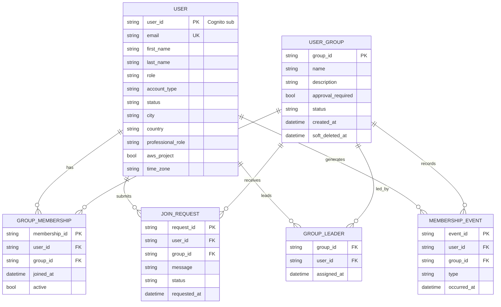
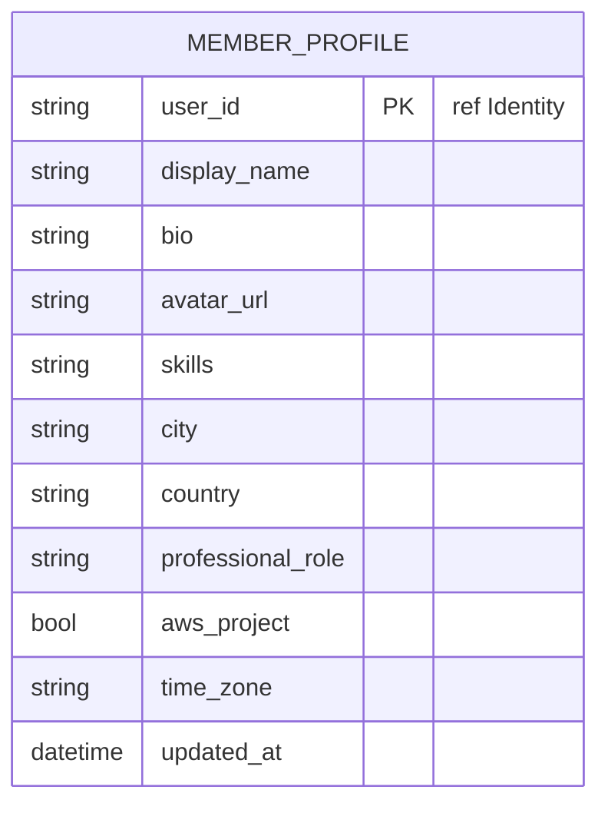
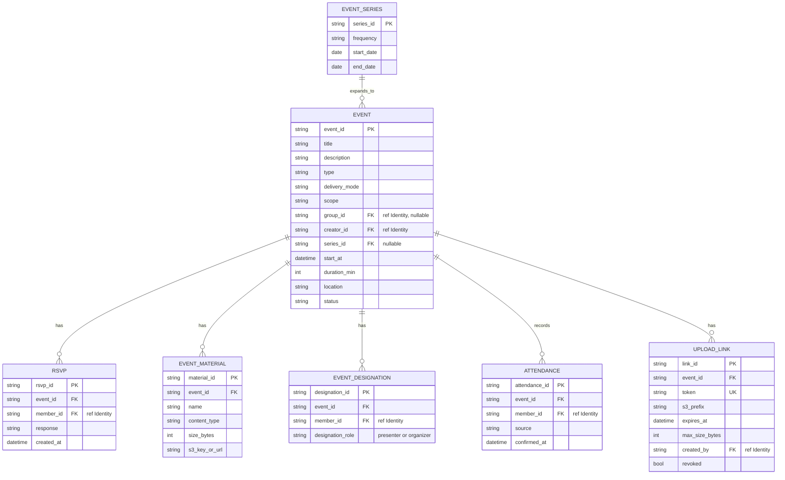
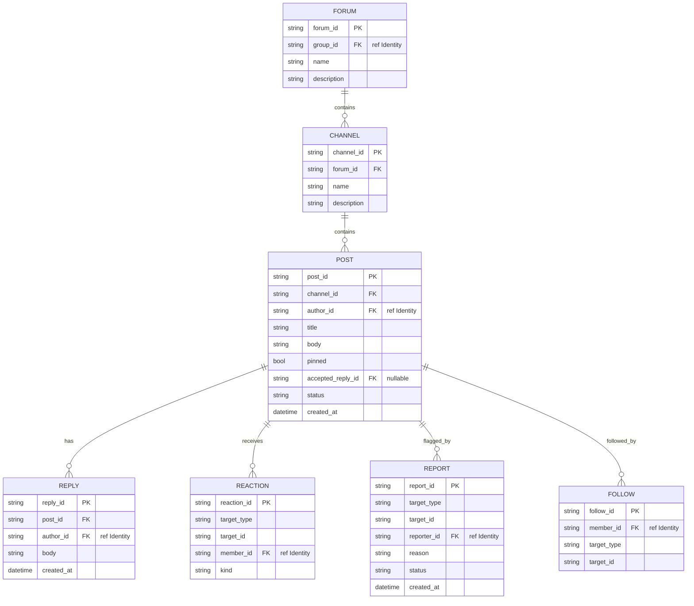
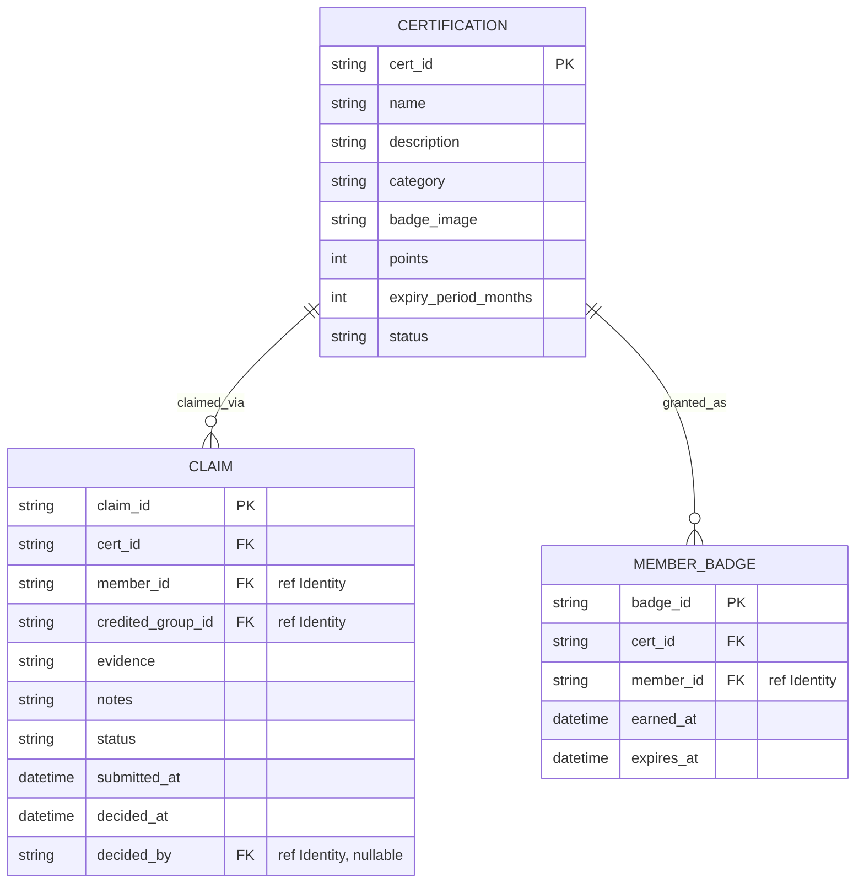
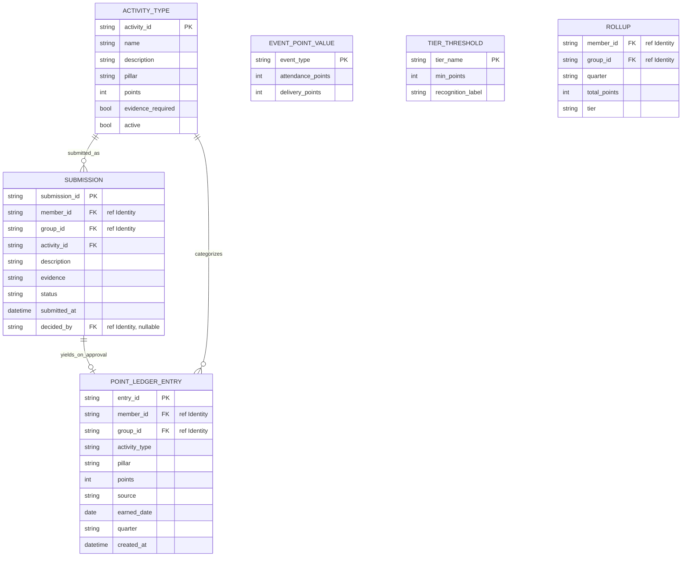
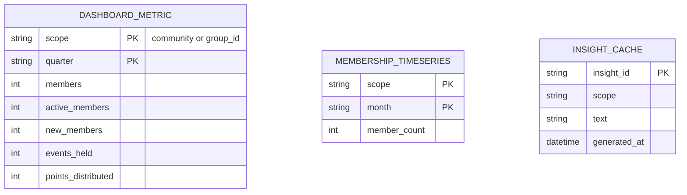
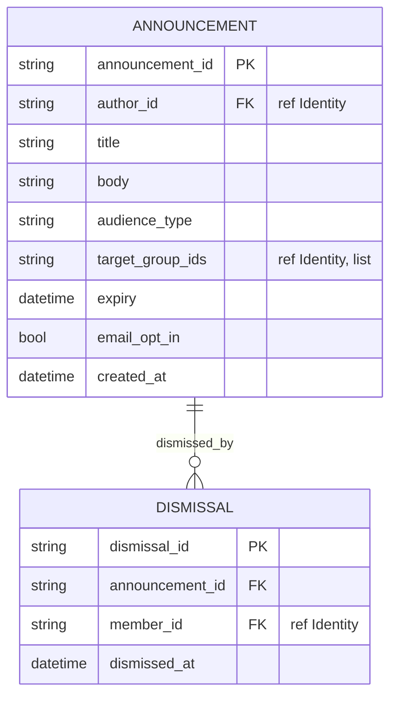
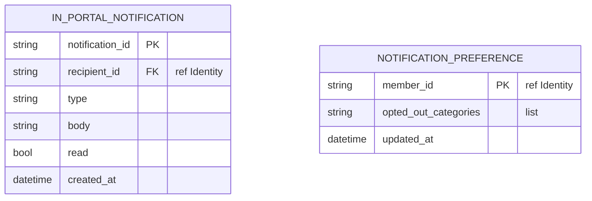
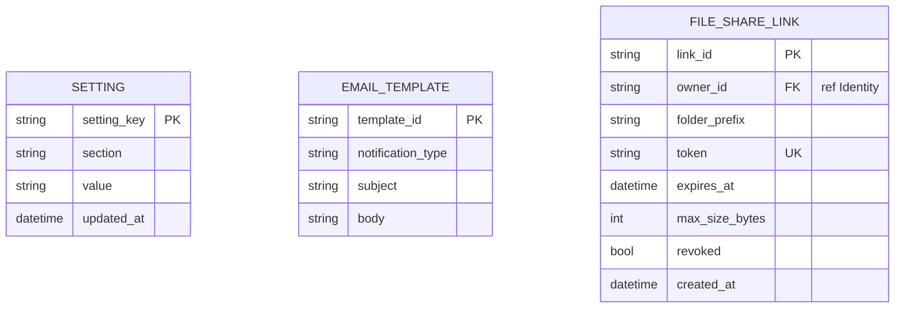

# Entity-Relationship Diagrams (ERD) — AWS Community Portal

Data model as Mermaid `erDiagram`, **grouped by service**. Because the architecture is **microservices with table-per-service** (Q5=B), each service owns its own entities/tables — there are **no cross-service foreign keys**. Attributes that reference another service (e.g., `member_id`, `group_id`) are **soft references** (marked `FK` with a `"ref <Service>"` comment) resolved via APIs/events, not database joins.

Notes:
- This is a logical model for design; concrete DynamoDB key/GSI design (single-table-per-service, partition/sort keys) is done in per-unit Functional/Infrastructure Design.
- Derived/read-only stores (Analytics projections, Search vectors) are noted but not modeled as relational tables.
- Cardinality: `||--o{` = one-to-zero-or-many, `||--||` = one-to-one, `}o--o{` = many-to-many.

---

## 1. Identity & Access Service
Owns users (portal records projected from Cognito), groups, memberships, membership history, join requests, and leader assignments. Local-admin credentials live in Secrets Manager; audit logs in CloudWatch (not modeled).

---

## 2. Member Profiles & Directory Service
Owns the member profile record (identity fields are Cognito-owned, projected). Semantic-search vectors live in OpenSearch (not relational).

---

## 3. Events Service
Owns events (and recurrence series), RSVPs, materials, presenter/organizer designations, attendance, and event-scoped upload links.

---

## 4. Forums Service
Owns forums, channels, posts, replies, reactions, follows, and reports. Post/reply embeddings live in OpenSearch (not relational).

---

## 5. Certifications Service
Owns certification definitions (per-cert points), member claims, and earned badges.

---

## 6. Contributions & Scoring Service
System of record for the **append-only point ledger**. Framework config (activity types, event point values, tier thresholds), evidence submissions, and derived rollups. Balances/tiers are computed at runtime from the ledger (rollups are a derived cache).

---

## 7. Analytics Service (read model)
Read-only projections fed from EventBridge + DynamoDB Streams into a separate analytics store (concrete service deferred to Infrastructure Design). Entities below are **derived** projections/caches, not authoritative tables.

---

## 8. Announcements Service
Owns announcements and per-member dismissals.

---

## 9. Notifications Service
Owns in-portal notifications and per-user preferences. Email is sent via SES (not stored).

---

## 10. Platform / Settings Service
Owns system settings, email templates, and external file-share links.

---

## 11. Help Assistant Service
**No persistent entities.** Stateless conversational service; chat history is session-only (client-side). Grounding knowledge is derived from portal docs via the AI Gateway (and optionally the Search index) — no owned tables.

## Shared capabilities (non-relational)
- **Search Service** — owns an **Amazon OpenSearch Serverless** vector collection (member and forum embeddings). Not a relational store; documents keyed by `member_id` / `post_id` / `reply_id`.
- **AI Gateway Service** — stateless facade over Amazon Bedrock; no owned data.
- **What's New (Module 11)** — frontend-only; its only persisted config (feed URL + toggle) lives in the **Settings** service (`SETTING`).

---

## Cross-service reference summary
These IDs recur as **soft references** (no cross-DB FK); resolved via APIs/events:
| Reference | Owned by | Used by |
|---|---|---|
| `user_id` / `member_id` | Identity & Access | Members, Events, Forums, Certifications, Contributions, Announcements, Notifications, Settings |
| `group_id` | Identity & Access | Events, Forums, Certifications, Contributions, Announcements |
| `event_id` | Events | Contributions (via events), Content Library |
| `cert_id` | Certifications | Contributions (per-cert points on approval) |
| `post_id` / `reply_id` | Forums | Search (embeddings), Contributions (forum points) |
