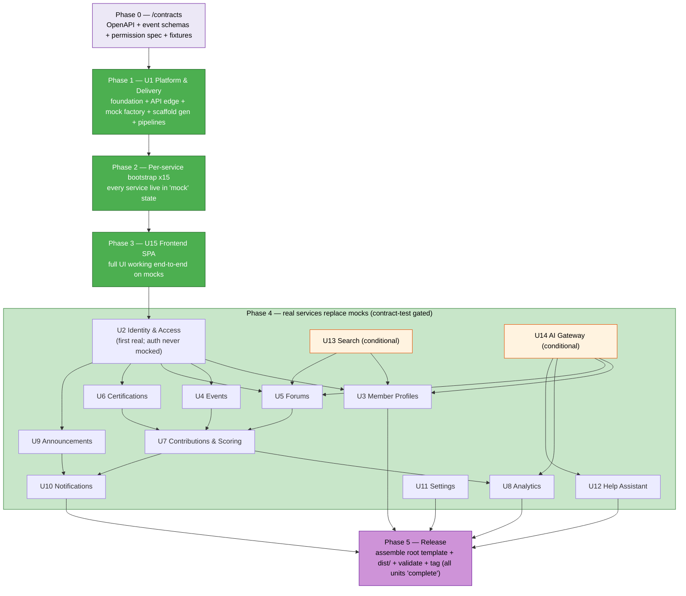

# Unit of Work — AWS Community Portal

**Stage**: INCEPTION → Units Generation (Part 2 — Generation). Decomposition of the system into **15 independently deployable units**. Companion artifacts: `unit-of-work-dependency.md` (dependency matrix + build order), `unit-of-work-story-map.md` (144 stories → units). Planning decisions: `../../plans/unit-of-work-plan.md`.

## Decisions applied (from the approved plan)
| Ref | Decision |
|---|---|
| FQ0/Q1 | One unit per service → **15 units** |
| FQ1 | **No shared libraries** — each service self-contained; agreements are specs, not code |
| FQ2 | Async events (EventBridge + DynamoDB Streams + SQS) for cross-service workflows; **REST only for synchronous reads** |
| FQ3a | **AuthN at the edge (Cognito authorizer); authZ in-service**, fail-closed, driven by a machine-readable permission spec in `/contracts/platform/permissions` |
| FQ3b | Central versioned **`/contracts`** registry, sub-foldered per owning service |
| FQ4 | Single **monorepo**: `/services`, `/frontend`, `/infra`, `/contracts` (no `/shared`) |
| D8 | **Python** for all backend services; TypeScript/React+Vite frontend |
| D1/D2 | Root CloudFormation template with **nested per-service stacks**; single shared API Gateway; dependencies passed as **Parameters** (never `Fn::ImportValue`) |
| D3 | `Conditions` gate **Search (OpenSearch)** and **AI (Bedrock)**; consumers degrade gracefully |
| D4 | Source distribution; prebuilt dependency-complete artifacts in `dist/`; customer runs `sam deploy` |
| D5 | **AWS CodePipeline**, one pipeline per service (each its own CFN stack); **contract-test stage is the gate** |
| D6 | `DeletionPolicy`/`UpdateReplacePolicy: Retain` on all DynamoDB tables + S3 buckets |
| D9 | Each service split into **`-data`** and **`-app`** stacks |
| D10 | Single **Platform & Delivery** unit owns the delivery substrate (absorbs API Edge) |
| D11/D12/D15 | Mock Platform is a **factory**; each service gets a **bootstrap/scaffold** at day 0 with the mock as the seed |
| D13/FQ8 | Service states **mock → partial → complete**; unimplemented endpoints return **`501`** |
| FQ7 | **No swap mechanism** — the mock is the scaffold seed; transition to real is the service's ordinary contract-test-gated code deploy |
| D14 | **No automated release gate** — release is a one-time action after all units complete; `service-mode` manifest is informational only |

## Definition
A **unit of work** = one independently deployable service (its own `-data`/`-app` stacks + CI/CD pipeline), self-contained (no shared code), owning its own DynamoDB table(s), collaborating via events/REST contracts in `/contracts`.

---

## Unit Catalog

### Unit 1 — Platform & Delivery (foundation + edge + factory + delivery)
- **Type**: Platform substrate (built first; not a business service).
- **Responsibilities**:
  - **Foundation stack**: VPC, subnets (public/private multi-AZ), NAT, VPC endpoints, **Cognito user pool** (+ custom-auth OTP triggers), **EventBridge bus**, observability baseline (CloudWatch, X-Ray). Publishes IDs/ARNs as stack outputs.
  - **API Edge**: single **API Gateway (REST)** + **Cognito authorizer** (authN). Services attach their own routes.
  - **`/contracts` tooling**: OpenAPI + event JSON Schema conventions; the RBAC permission spec.
  - **Mock factory**: generates a Python mock Lambda per service from each service's OpenAPI; shared fixtures; realism/chaos controls.
  - **Contract-test harness**: the suite run against both mock and real (the pipeline gate).
  - **Bootstrap/scaffold generator**: emits each service's `-data`/`-app` templates, routes, mock handler, pipeline.
  - **Reusable CodePipeline template**; **root template** + nested composition + `Conditions` (D3) + seeding custom resources (D7); packaging (`dist/`); `service-mode` dev-tracking manifest.
- **Owns**: shared infra (VPC/Cognito/EventBridge/API GW), `/contracts`, mock/factory tooling, root template, pipelines.
- **Publishes/consumes events**: n/a (infrastructure).
- **Stacks**: `foundation.yaml`, `api-edge.yaml`, `root-template.yaml`, `seed.yaml`, `pipeline-*.yaml` (template).
- **Assigned stories**: none directly (enables all). Hosts cross-cutting infra for US-1.13 audit sink, US-1.2/1.32 Cognito.

### Unit 2 — Identity & Access
- **Paths**: `/auth`, `/users`, `/groups`. **First real service** (auth never mocked).
- **Responsibilities**: Cognito sign-in + periodic OTP, JIT provisioning, scheduled sync, bulk import, built-in local Administrator (Secrets Manager), RBAC role assignment, user groups (CRUD, join/leave, approvals, UGL assignment, soft-delete/restore), append-only membership-event history (US-1.34), audit toggle. **Also owns the identity-facing admin member list + export (US-3.8/3.9 — reassigned from Unit 3, see below): `GET /users` already returns role/status/groups/city/country/professionalRole/awsProject via the existing GSI2 role index, so Administrators manage and export the member roster from this service, not Member Profiles.**
- **Owns**: Users/portal-records, Groups, Membership-events (append-only), Join-requests tables; local-admin secret (Secrets Manager).
- **Publishes**: `UserProvisioned`, `UserRoleChanged`, `UserDeactivated`, `UserReactivated`, `GroupCreated`, `GroupUpdated`, `GroupSoftDeleted`, `GroupRestored`, `GroupHardDeleted`, `MemberJoinedGroup`, `MemberLeftGroup`, `MemberRemoved`.
- **Consumes**: none critical (source of identity truth).
- **Stories (30)**: US-1.2–1.21, 1.26, 1.27, 1.28, 1.30, 1.31, 1.32, 1.33, 1.34, **US-3.8, US-3.9** (see story map).

### Unit 3 — Member Profiles & Directory
- **Paths**: `/members` (no `/admin/members` — see reassignment note below).
- **Responsibilities**: own/other profile view+edit (with an inline basic activity-count block, US-3.1/3.3), directory browse+search, leader-only detailed activity summary with points + date-range filter (US-3.10); delegates semantic search to Search (conditional). **Admin member list + export (US-3.8/US-3.9) reassigned to Unit 2 Identity & Access** (2026-08-02, user-confirmed): Identity's `PortalUser` table already carries every field those stories need (city/country/professionalRole/awsProject/status/groups) behind an existing GSI2 role index, and the shipped frontend (`AdminUsersPage.tsx`) and mockup (`admin/users.html`) already call Identity's `GET /users`, not this unit's `/admin/members`. Building a second admin-list index on the Member Profiles table would duplicate Identity's data with sync lag for no benefit.
- **Owns**: Member-profile table (denormalized, event-sourced cache — not a second source of truth for identity/role/membership).
- **Publishes**: `MemberProfileUpserted`.
- **Consumes**: `UserProvisioned`, `UserRoleChanged`, `UserDeactivated`, `MemberJoinedGroup`, `MemberLeftGroup`, `MemberRemoved` (align profile + per-group join-date records — 3 events added beyond the original 3, needed for US-3.4's per-group join-date column).
- **Stories (8)**: US-3.1, 3.2, 3.3, 3.4, 3.5, 3.6, 3.7, 3.10 (US-3.8/3.9 moved to Unit 2 — see above).

### Unit 4 — Events
- **Paths**: `/events`.
- **Responsibilities**: events CRUD, recurring series, RSVP + .ics, calendar, materials (S3), MS Teams attendance (review-before-award), manual attendance, presenter/organizer designation, Content Library, event-scoped upload links.
- **Owns**: Events, RSVPs, Materials metadata, Upload-links tables; S3 for materials.
- **Publishes**: `AttendanceRecorded`, `EventDelivered`, `EventOrganized`, `EventCompleted`, `EventCancelled`, `MaterialsAdded`, `CalendarInviteDue`.
- **Consumes**: `GroupSoftDeleted` (cancel upcoming group events).
- **Stories (21)**: US-2.1–2.21.

### Unit 5 — Forums
- **Paths**: `/forums`, `/channels`, `/posts`, `/replies`.
- **Responsibilities**: forums/channels/posts/replies, reactions, @mention (access-scoped), accepted answer, pin, follow, report/moderation, **literal keyword search (in-service)**. *(Functional Design 2026-08-08 deviations DV-1/DV-2: **duplicate-flag/LLM detection removed** and **semantic search downgraded to keyword** — Forums no longer depends on Search (13) or AI Gateway (14) at runtime.)*
- **Owns**: Forums/Channels/Posts/Replies, Reactions, Follows, Reports tables; S3 prefix for post images (≤5/post).
- **Publishes**: `ForumPostCreated`, `ForumReplyCreated`, `PostDeleted`, `ForumChannelDeleted`, `MemberMentioned`, `PostReported`.
- **Consumes**: `GroupHardDeleted` (cascade-remove content), `GroupSoftDeleted` (hide group forums), `GroupRestored` (un-hide). Single synchronous outbound read: Identity `mentionSuggest` for @mention candidates. *(No AI dup-check; no Search index events post-DV-1/DV-2.)*
- **Stories (18)**: US-4.1–4.18.

### Unit 6 — Certifications
- **Paths**: `/certifications`.
- **Responsibilities**: definitions (per-cert points), claims, credited-group verification queue, expiry scheduled job, revoke, badges, catalog.
- **Owns**: Certifications, Claims tables.
- **Publishes**: `CertificationApproved`, `CertificationRevoked`, `CertificationExpired`.
- **Consumes**: `MemberLeftGroup`, `MemberRemoved` (auto-reject pending claims); UGL reassignment.
- **Stories (10)**: US-5.1–5.10.

### Unit 7 — Contributions & Scoring
- **Paths**: `/contributions`.
- **Responsibilities**: **append-only point ledger** (system of record), scoring framework config (fixed 6 auto), evidence submissions + approval, manual adjustments, runtime per-group tiers, leaderboards, summaries, Streams-maintained rollups.
- **Owns**: Ledger (append-only), Framework config, Submissions, Rollups (derived) tables.
- **Publishes**: `PointsAwarded`, `PointsAdjusted`, `TierAchieved`.
- **Consumes**: `AttendanceRecorded`, `EventDelivered`, `EventOrganized`, `ForumPostCreated`, `ForumReplyCreated`, `CertificationApproved` (auto-award); `MemberLeftGroup`, `GroupHardDeleted`.
- **Stories (18)**: US-6.1–6.18.

### Unit 8 — Analytics
- **Paths**: `/analytics`.
- **Responsibilities**: dashboards, charts, CSV exports, AI reporting agent + suggested insights; read-model fed from Streams/events into a separate analytics store (store choice deferred to Infra Design).
- **Owns**: Analytics store (derived projections), insights cache.
- **Publishes**: none (read-side).
- **Consumes**: domain events + Streams from Contributions, Events, Certifications, Identity (membership history), Forums; uses AI Gateway.
- **Stories (11)**: US-7.1–7.11. **Conditional on AI** for US-7.7/7.8.

### Unit 9 — Announcements
- **Paths**: `/announcements`.
- **Responsibilities**: authoring, targeting (community/group), panel retrieval, client-side dismissal, optional email via Notifications, mandatory expiry (TTL).
- **Owns**: Announcements table. *(Dismissals table removed 2026-08-07 — dismissal is UI-only/localStorage per the Unit 9 functional-design decision; no server-side dismissal store.)*
- **Publishes**: `AnnouncementPublished`.
- **Consumes**: `GroupSoftDeleted` (hide group announcements), `EventCreated` (auto-post an announcement when `announce=true`, US-2.1).
- **Stories (5)**: US-10.1–10.5.

### Unit 10 — Notifications
- **Paths**: `/notifications`.
- **Responsibilities**: email (SES, retry/backoff/DLQ) + in-portal notifications; enforce US-8.15 recipient matrix + preferences; in-portal panel (latest 20 unread).
- **Owns**: In-portal notifications, Preferences tables.
- **Publishes**: none.
- **Consumes**: most domain events via EventBridge → SQS (durable) → SES/in-portal.
- **Stories (6)**: US-8.2, 8.4, 8.5, 8.6, 8.7, 8.15.

### Unit 11 — Settings (business Platform/Settings service)
- **Paths**: `/settings`. *(Renamed from "Platform / Settings" to avoid clash with Unit 1 Platform & Delivery.)*
- **Responsibilities**: admin settings (sync schedule, community access/OTP/session, MS Teams, Bedrock model, dup toggle, What's New feed URL+toggle, email sender+templates, branding, default tz, audit toggle), external file-share links (S3 presign), time-zone defaults.
- **Owns**: Settings, Email-templates, File-share links tables.
- **Publishes**: `SettingsChanged`.
- **Consumes**: none critical.
- **Stories (3)**: US-8.3, 8.13, 8.14. Also hosts **What's New config** (US-11.1, US-11.6).

### Unit 12 — Help Assistant
- **Paths**: `/help`. **Conditional on AI (D3)**.
- **Responsibilities**: scoped conversational assistant (portal-only), grounded via AI Gateway, role-aware, refuses out-of-scope/implementation questions.
- **Owns**: stateless (session-only client-side history); optional KB index (may reuse Search).
- **Consumes**: AI Gateway.
- **Stories (4)**: US-9.1–9.4.

### Unit 13 — Search (shared) — **Conditional on Search/OpenSearch (D3)**
- **Responsibilities**: owns OpenSearch Serverless vector index; index/query APIs; consumes indexing events/Streams from Members & Forums.
- **Owns**: OpenSearch Serverless collection.
- **Publishes**: none.
- **Consumes**: `MemberProfileUpserted`, `ForumPostCreated`, `ForumReplyCreated`, `PostDeleted`, `ForumChannelDeleted`, `GroupHardDeleted`.
- **Stories**: supports US-3.5, US-4.13 (owned by Members/Forums; Search is the shared enabler). Degrades to keyword/DynamoDB query when disabled.

### Unit 14 — AI Gateway (shared) — **Conditional on AI/Bedrock (D3)**
- **Responsibilities**: single controlled entry to Amazon Bedrock (embeddings, duplicate detection, AI reporting, insights, help); model config + guardrails.
- **Owns**: no business data (config only).
- **Consumes**: invoked synchronously by Search, Forums, Contributions, Analytics, Help.
- **Stories**: enables US-4.5 (dup), US-7.7/7.8 (reporting/insights), US-9.x (help), US-3.5/4.13 (embeddings). Features disabled/degraded when off.

### Unit 15 — Frontend SPA
- **Type**: React + Vite SPA, S3 + CloudFront + WAF. Built **early against mocks**.
- **Responsibilities**: role-aware SPA (admin/leader/ugl/member), feature folders per module, shared design system; **What's New** client-side RSS (US-11.2–11.5, 11.7); treats `501` as first-class (feature hidden / "coming soon").
- **Owns**: static assets (no backend data).
- **Consumes**: all service REST APIs via API Gateway.
- **Stories (13)**: US-8.1, 8.8, 8.9, US-11.2, 11.3, 11.4, 11.5, 11.7 (+ renders all module UIs).

---

## Story coverage
144 active stories, 100% assigned. Per-unit counts: Identity 30 (28 + US-3.8/3.9 reassigned 2026-08-02) · Members 8 (10 − US-3.8/3.9) · Events 21 · Forums 18 · Certifications 10 · Contributions 18 · Analytics 11 · Notifications 6 · Settings 3 (+2 What's New config) · Help 4 · Announcements 5 · Frontend 3 (+5 What's New UI). Search/AI Gateway are shared enablers (no exclusively-owned stories). Full mapping in `unit-of-work-story-map.md`.

---

## Code Organization Strategy (Greenfield — monorepo)

Single monorepo. Each backend service is self-contained (no cross-service imports; no `/shared`). Cross-service agreements live only as specifications in `/contracts`. Backend = Python; frontend = TypeScript/React+Vite; IaC = CloudFormation + SAM.

```text
community-portal/
├── contracts/                          # source of truth — specs only, NO runtime code (FQ3b)
│   ├── README.md                       # ownership + versioning conventions
│   ├── services/
│   │   ├── identity-access/            openapi.yaml + published-events/*.v1.json
│   │   ├── member-profiles/            openapi.yaml + published-events/*.v1.json
│   │   ├── events/                     openapi.yaml + published-events/*.v1.json
│   │   ├── forums/                     openapi.yaml + published-events/*.v1.json
│   │   ├── certifications/             openapi.yaml + published-events/*.v1.json
│   │   ├── contributions-scoring/      openapi.yaml + published-events/*.v1.json
│   │   ├── analytics/                  openapi.yaml
│   │   ├── announcements/              openapi.yaml + published-events/*.v1.json
│   │   ├── notifications/              openapi.yaml
│   │   ├── settings/                   openapi.yaml + published-events/*.v1.json
│   │   ├── help-assistant/             openapi.yaml
│   │   ├── search/                     openapi.yaml
│   │   └── ai-gateway/                 openapi.yaml
│   └── platform/
│       ├── permissions/role-permission-matrix.v1.json   # FQ3a authZ source of truth
│       ├── event-envelope.v1.json
│       └── error-response.v1.json
│
├── services/                           # one self-contained Python package per backend unit
│   ├── identity-access/
│   │   ├── src/                        handlers, domain, persistence, authz (own impl — no shared lib)
│   │   ├── tests/                      unit tests
│   │   ├── requirements.txt            pinned deps (vendored at package time)
│   │   └── README.md
│   ├── member-profiles/  ├─ (same shape)
│   ├── events/           │
│   ├── forums/           │
│   ├── certifications/   │
│   ├── contributions-scoring/
│   ├── analytics/
│   ├── announcements/
│   ├── notifications/
│   ├── settings/
│   ├── help-assistant/
│   ├── search/
│   └── ai-gateway/
│
├── frontend/                           # React + Vite SPA (TypeScript) — Unit 15
│   ├── src/features/<module>/          feature folders per module
│   ├── src/components/                 shared design system
│   ├── src/lib/apiClient.ts            REST client (handles 501 → "coming soon")
│   └── ...
│
├── infra/                              # CloudFormation + SAM
│   ├── foundation.yaml                 VPC, Cognito, EventBridge bus, observability (Unit 1)
│   ├── api-edge.yaml                   shared API Gateway + Cognito authorizer (Unit 1)
│   ├── root-template.yaml              customer entry point — nests everything (Unit 1)
│   ├── seed.yaml                       install-time seeding custom resources (Unit 1)
│   ├── services/
│   │   ├── service-<name>-data.yaml    tables/Streams/buckets — Retain (D9); deployed once
│   │   └── service-<name>-app.yaml     Lambda/role/routes/rules/alarms (D9); redeployed each change
│   └── pipelines/
│       └── pipeline-<name>.yaml        per-service CodePipeline stack (D5)
│
├── platform/                           # Platform & Delivery tooling (Unit 1)
│   ├── mock-factory/                   generates Python mock Lambda per service from contracts
│   ├── fixtures/                       ONE coherent seed dataset across services (4 personas)
│   ├── contract-tests/                 harness run vs mock AND real (pipeline gate)
│   └── scaffold-generator/             emits -data/-app/pipeline/mock for a new service
│
├── dist/                               # release output — prebuilt dependency-complete artifacts (D4)
├── service-mode.json                   # informational: each service mock|partial|complete (D14)
└── README.md                           # build + deploy docs (dev + customer install)
```

### Per-service bootstrap (day 0, D12)
For every service the scaffold generator emits: `service-<name>-data.yaml` (real, Retain), `service-<name>-app.yaml` (real function + routes from its OpenAPI, mock handler as seed), `pipeline-<name>.yaml`, and contract-test wiring. The service is live in `mock` state from day 0; teams replace mock endpoints with real logic in `services/<name>/src/` over time.

---

## Delivery & CI/CD (Unit 1 owns; per D5/D12/FQ7)

### Per-service development pipeline (×15, each a CFN stack)
```
source → build (Python zip + vendored deps) → unit tests → CONTRACT TESTS (gate)
  → deploy -data (no-op after bootstrap) → deploy -app (code) → API create-deployment
  → smoke test → update service-mode.json (mock|partial|complete)
```
- **Gate**: real code reaches the function only if it passes the same contract suite the mock passed; unimplemented endpoints must return `501` (FQ8).
- **Transition = ordinary code deploy** (FQ7): same function/routes/table; no swap, no API rewiring, no data migration. Rollback = redeploy previous Lambda version.
- **Shared API Gateway**: each `-app` stack owns only its own routes; the `create-deployment` step is serialized to avoid dev-time deploy races (dev-only concern).

### Customer release (Unit 1, on release tag)
```
build all artifacts → dist/ (prebuilt, dependency-complete)
  → assemble root-template.yaml (nested) with Conditions (Search/AI)
  → validate (cfn-lint / staging deploy)
  → tag release (root + nested + source + dist pinned)
```
Customer clones the tagged repo and runs `sam deploy` into their own account/region (SAM uploads artifacts to a bucket there). No language toolchain required for the default install (D4). No automated release gate (D14) — release is cut only after all units are `complete`.

### Data safety (D6)
All DynamoDB tables and S3 buckets carry `DeletionPolicy: Retain` + `UpdateReplacePolicy: Retain`. The `-data`/`-app` split (D9) ensures frequent app redeploys never touch the data stacks.

---

## Unit Sequence Flow (by dependency)

Build/delivery sequence under the mock-first model. Solid arrows show the ordering/dependency that drives sequencing; units within the same rank of Phase 4 are independent and can proceed in parallel. Runtime coupling is async (events) — this is the *build* order, informed by `unit-of-work-dependency.md`.



### Text alternative
```
Phase 0  /contracts (OpenAPI + event schemas + permission spec + fixtures)   [prerequisite]
   ↓
Phase 1  U1 Platform & Delivery (foundation, API edge, mock factory, scaffold generator, pipelines)
   ↓
Phase 2  Per-service bootstrap ×15  → every service deployed in 'mock' state
   ↓
Phase 3  U15 Frontend SPA  → full UI working end-to-end through API Gateway against mocks
   ↓
Phase 4  Real services replace mocks (each gated by contract tests), dependency-informed:
         - U2 Identity & Access ....... first (auth never mocked); unblocks 3,4,5,6,9
         - U3 Members | U4 Events | U5 Forums | U6 Certifications ... parallel (depend on U2)
         - U7 Contributions & Scoring . after 4,5,6 (consumes their events for auto-award)
         - U8 Analytics ............... after U7 (downstream projections)
         - U13 Search | U14 AI Gateway  shared enablers (conditional, D3); feed 3,5,8,12
         - U10 Notifications .......... event sink for 2,4,5,6,7,9
         - U9 Announcements | U11 Settings | U12 Help Assistant
   ↓
Phase 5  Release (assemble root template + dist/ artifacts + validate + tag; after all units 'complete')

Parallelism: Phase-2 bootstraps are all independent. In Phase 4, {U3,U4,U5,U6} are mutually
independent (parallel); {U13,U14} are optional and can be sequenced late. Because every service
exists as a mock from Phase 2, a real service can develop against another's mock — no strict
finish-before-start dependency.
```

**Reading the arrows**: an arrow A → B means "B's build is sequenced after A" (B depends on A's events/reads or on A being real). It is *not* a synchronous runtime call unless noted as REST in `unit-of-work-dependency.md`; cross-service runtime coupling remains asynchronous (EventBridge/Streams/SQS).
