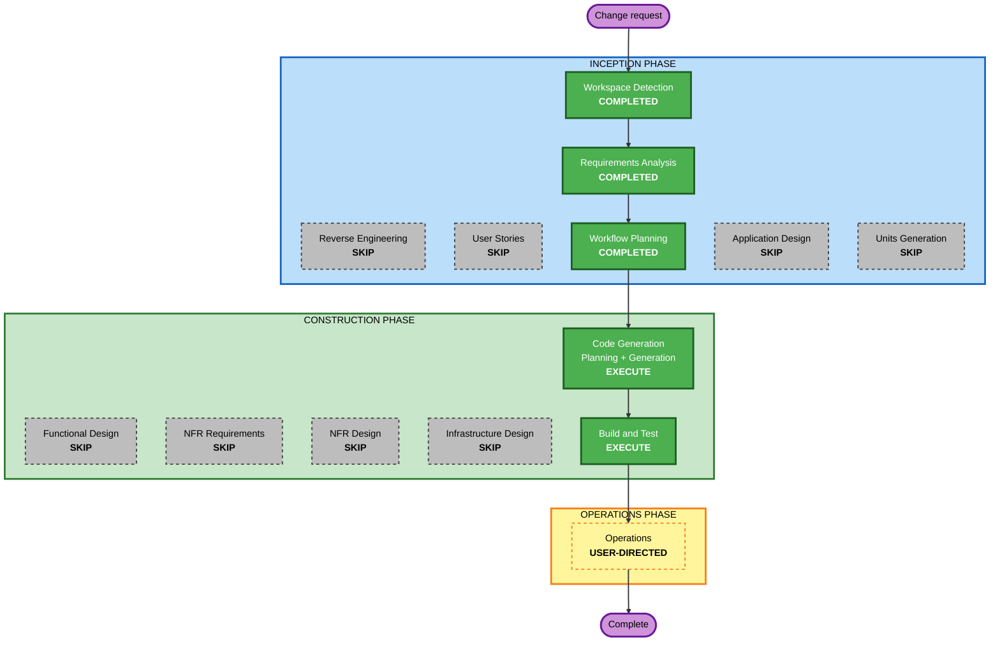

# Execution Plan — Adjust Points screen rework (US-6.15)

**Date**: 2026-08-11
**Requirements**: `aidlc-docs/inception/business-requirements/adjust-points-rework-requirements.md` (approved 2026-08-11)
**Scope**: Unit 15 (Frontend SPA) only

---

## 1. Detailed analysis summary

### Transformation scope

- **Transformation type**: Single component — one screen inside an existing, deployed SPA
- **Primary change**: replace the generic six-free-text-box adjust form with a purpose-built screen (searchable member, member-derived group dropdown, quarter dropdown, sign-constrained integer delta, impact preview, reverse-an-entry list)
- **Related components**: none. Planning removed the one backend touchpoint that Requirements had proposed (see DR-3 revision below)

### Change impact assessment

| Area | Impact |
|---|---|
| User-facing | **Yes** — this is the entire point. Two leader roles (CL, UGL) get a screen that currently cannot complete its primary action at all |
| Structural | **No** — no new component boundaries, no new service, no new route in the SPA (the screen stays inside the Approvals tab) |
| Data model | **No** — the ledger entry written is byte-for-byte the shape already written today |
| API | **No** — revised at planning. Every call needed already exists in the frozen contract and is already served by a real service |
| NFR | **Marginal** — one additional read per member selection, debounced typeahead, graceful degradation of the preview. No performance, scaling or security posture change |

### Why the API change was dropped

Requirements DR-3 proposed an additive optional `quarter` parameter on `GET /contributions/ledger`. Planning found it redundant: FR-13 needs the member's history for the chosen **group across all quarters**, because an entry is reversible regardless of the quarter it sits in. The frontend therefore already holds every row it needs, and FR-11's quarter total is a filter over the same response. Adding the parameter would have bought nothing and cost a service change, a contract version bump and a Lambda redeploy.

**Consequence**: the change is SPA-only. Deployment is `npm run build` plus a static-asset sync and a CloudFront invalidation — no stack update.

### Component relationships

- **Primary**: `frontend/src/features/ContributionsPage.tsx` → `Approvals()`
- **Reused unchanged**: `PeoplePicker.tsx` (member typeahead, already group-scopeable), `frontend/src/lib/quarters.ts` (`trailingQuarters(8)`), `useGroupName.ts` / `groupNameFrom` (id → name), `useApi` / `apiFetch`, `DataTable`
- **Likely retired from this screen**: `FormModal` — it cannot express a typeahead, a dependent dropdown, a sign-constrained numeric field or a preview, and its string-only submission is the cause of the live defect
- **Dependent components**: none. Nothing else in the SPA imports the adjust form
- **Backend**: read-only consumer of `contributions-scoring`, `member-profiles`, `identity-access` — all in `complete` mode, none modified

### Risk assessment

- **Risk level**: **Low**
- **Rollback complexity**: **Easy** — static-asset redeploy of the previous bundle; no schema, contract or stack change to unwind
- **Testing complexity**: **Moderate** — the logic worth testing (sign parsing, projected total, already-reversed derivation, role-dependent scoping) is pure and unit-testable, but the repo has no component-testing library installed, so tests target extracted pure helpers rather than rendered DOM
- **Residual risk**: writes land in an append-only ledger (BR-J1). A wrong adjustment is permanent and correctable only by a compensating entry. FR-11 (impact preview) and FR-8 (mandatory explicit sign) exist specifically to reduce that risk, and FR-16 tells the leader the write is permanent before they make it

---

## 2. Workflow visualization



### Text alternative

```text
INCEPTION
  Workspace Detection ....... COMPLETED (resumed existing project)
  Reverse Engineering ....... SKIP
  Requirements Analysis ..... COMPLETED (approved)
  User Stories .............. SKIP
  Workflow Planning ......... COMPLETED (this document)
  Application Design ........ SKIP
  Units Generation .......... SKIP

CONSTRUCTION
  Functional Design ......... SKIP
  NFR Requirements .......... SKIP
  NFR Design ................ SKIP
  Infrastructure Design ..... SKIP
  Code Generation ........... EXECUTE  <- Part 1 plan, then Part 2 generation
  Build and Test ............ EXECUTE

OPERATIONS
  Operations ................ USER-DIRECTED (SPA-only deploy, if requested)
```

---

## 3. Stages

### INCEPTION

- [x] **Workspace Detection** — COMPLETED. Resumed from `aidlc-state.md`
- [x] **Reverse Engineering** — SKIP. The project's own `aidlc-docs` are the authority; no undocumented codebase to analyse
- [x] **Requirements Analysis** — COMPLETED and approved. FR-1..16, NFR-1..7, DR-1..3
- [x] **User Stories** — SKIP. **Rationale**: US-6.15 already specifies every behaviour in scope, including the reverse-entry half that has never been built. New stories would restate it. The story is amended in place during Code Generation instead, with the deviations noted, which is how this project has handled every prior requirement correction
- [x] **Workflow Planning** — COMPLETED (this document)
- [ ] **Application Design** — SKIP. **Rationale**: no new component, service or method. The change lives entirely inside one existing screen and reuses components that already exist. `AdjustmentManager.adjust` in `component-methods.md` already covers the backend method, unchanged
- [ ] **Units Generation** — SKIP. **Rationale**: the system is already decomposed into 15 units. This is a change within Unit 15, with Unit 7 as an unmodified read/write dependency

### CONSTRUCTION

- [ ] **Functional Design** — SKIP. **Rationale**: no new business logic and no new data. Every rule this screen obeys is already designed, documented and implemented — BR-A5 (scoping), BR-J1 (append-only), BR-J2 (single-use reversal), BR-J3 (no floor), BR-J4 (8-quarter window). The two design judgements this change did require (DR-1 UGL group list, DR-2 preview source) were taken during Requirements with the reasoning recorded. Precedent: the What's New module (Unit 15, 2026-08-10) ran Code-Generation-only for the same reason
- [ ] **NFR Requirements** — SKIP. **Rationale**: NFR-1..7 are already captured in the approved requirements. No new dependency, no tech-stack decision, no criticality change — this screen is not on any other service's runtime path
- [ ] **NFR Design** — SKIP. **Rationale**: dependent on NFR Requirements. The patterns needed (debounce, per-call error handling, graceful degradation) are established conventions in this SPA, not new design
- [ ] **Infrastructure Design** — SKIP. **Rationale**: zero infrastructure change. No resource, no IAM policy, no table, no GSI, no EventBridge rule, no `gen_api_edge.py` regeneration, no stack update
- [ ] **Code Generation** — **EXECUTE** (always). Part 1 produces a numbered plan with checkboxes and story traceability; Part 2 implements it
- [ ] **Build and Test** — **EXECUTE** (always). `tsc -b`, `npm run build`, `npm test`, and `make test` repo-wide to prove no regression

### OPERATIONS

- [ ] **Operations** — USER-DIRECTED. Deployment is an approved operator action via `infra/deploy.sh`, but this change needs no stack update — a build, an `aws s3 sync` (without `--delete`, excluding `config.json`, per the two incidents already recorded in this project) and a CloudFront invalidation. Not performed unless requested

---

## 4. Code Generation scope preview

Indicative, to be confirmed in the Part 1 plan:

| Item | Nature |
|---|---|
| `AdjustPointsModal` (new component) | The reworked form: member typeahead, dependent group dropdown, quarter dropdown, signed-delta field, impact preview, guidance note |
| Member point history + reverse action | FR-13/14/15 — list from `GET /contributions/ledger`, reverse via `POST /contributions/adjustments/reverse`, already-reversed rows derived and disabled |
| Extracted pure helpers | Signed-delta parsing/validation, projected-total arithmetic, already-reversed derivation, member-group-to-option mapping with role scoping — extracted specifically so they are testable without a DOM library |
| `Approvals()` in `ContributionsPage.tsx` | Swap the `FormModal` call for the new component |
| Frontend tests | Extending the existing vitest suite (71 tests), including a case pinning the integer-typed delta so the live defect cannot regress |
| `stories.md` + use case 06 | Amend US-6.15 in place: note the defect fix and record that the reverse-entry half is now built |

Not in scope: any file under `services/`, `contracts/`, `infra/`, or `platform/`.

---

## 5. Success criteria

- **Primary goal**: a CL and a UGL can complete a manual point adjustment without knowing any internal id — and it succeeds, which it does not today
- **Key deliverables**: the reworked screen; the reverse-entry capability that closes US-6.15; the string-delta defect fixed and pinned by a test
- **Quality gates**: `tsc -b` clean · `npm run build` clean · frontend tests green with new cases · `make test` green repo-wide (no regression in the 8 service suites) · ruff clean (expected trivially — no Python touched) · no raw internal id rendered anywhere on the screen
- **Explicit non-goal**: in-portal notification delivery of the adjustment. `PointsAdjusted` is published as it is today, but Notifications remains a mocked service, so nothing is delivered. Unchanged by this work and not a blocker

## 6. Extension compliance

- **Security Baseline**: SECURITY-05 compliant (client validation added, unchanged server validation remains the enforcement point) · SECURITY-08 compliant (no authorization change; UI scoping documented as usability, never a control) · SECURITY-15 compliant (explicit error handling and fail-safe behaviour on every added call). SECURITY-01/02/03/04/06/07/09/10/11/12/13/14 **N/A** — no data store, network intermediary, IAM policy, dependency, auth surface or server component is touched
- **Resiliency Baseline**: RESILIENCY-10 compliant (explicit timeouts and graceful degradation on the preview and history reads). RESILIENCY-01/02/03/04/08/11/12 already settled project-wide and unchanged. RESILIENCY-05/06/07/09/13/14/15 **N/A** for a static-asset change with no new server component
- **Property-Based Testing**: opted out project-wide
- **Blocking findings**: none
