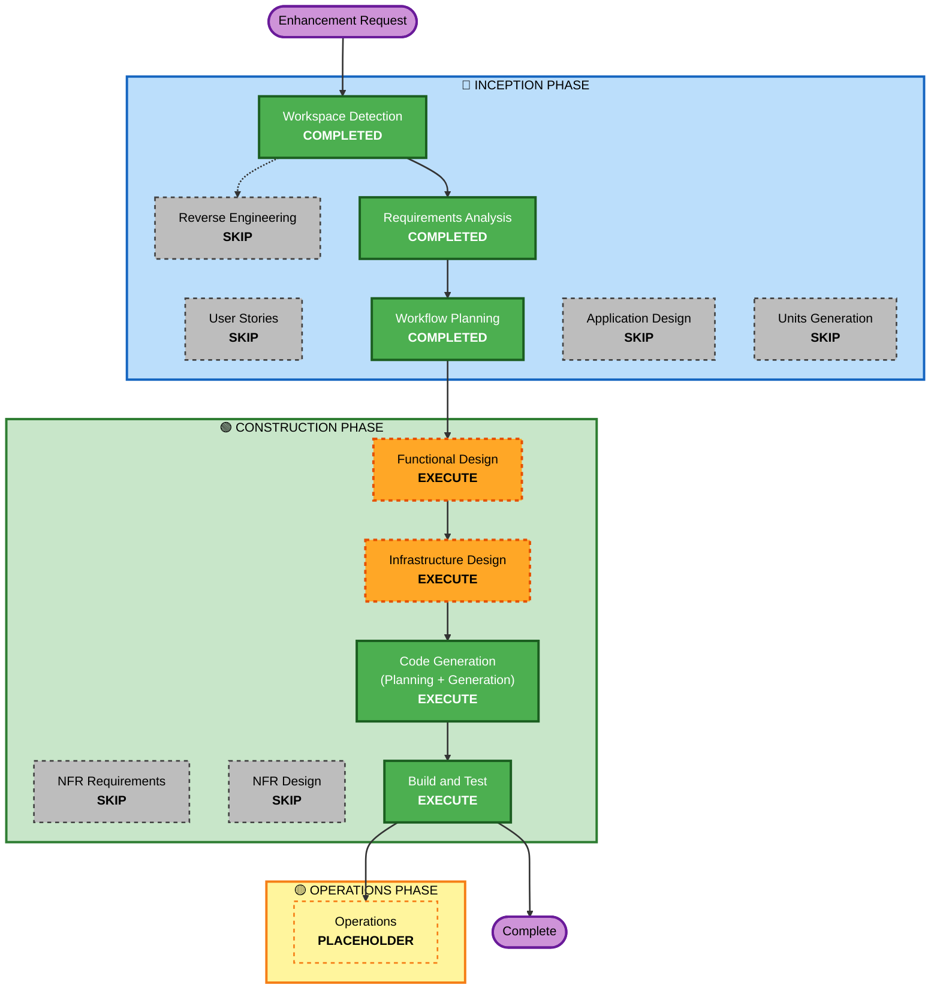

# Execution Plan — Certification Ledger + CL/UGL Dashboard Charts

**Date**: 2026-08-12
**Requirements**: `aidlc-docs/inception/business-requirements/certification-ledger-requirements.md` (APPROVED)
**Units touched**: Unit 6 (Certifications service — backend + IaC) · Unit 15 (SPA)

---

## Detailed Analysis Summary

### Transformation Scope (Brownfield)
- **Transformation Type**: Single-service feature addition (no new service, no deployment-model change)
- **Primary Changes**:
  1. **New read/aggregation access pattern** on the Certifications service — one new sparse "granted" GSI (partitioned by earned-quarter) + a one-time backfill migration, feeding a paged ledger endpoint and two chart-aggregation endpoints.
  2. **Small write-path change** — earned date becomes mandatory on claim submission (extends BR-C5).
  3. **Frontend** — a new "Certification Ledger" tab on the Certifications page and two charts on both leader dashboards.

### Change Impact Assessment
- **User-facing changes**: **Yes** — new ledger tab (CL + UGL), two dashboard charts, mandatory earned-date field on the claim form.
- **Structural changes**: **No** — stays inside the Certifications bounded context; no new service or component.
- **Data model changes**: **Yes** — new GSI + projected/retained key attributes on the Claim item; backfill of existing granted claims.
- **API changes**: **Yes, additive** — new `GET /certifications/ledger`, `/certifications/stats/growth`, `/certifications/stats/snapshot`, all under the already-routed `/certifications` base path (**no api-edge regeneration**); certifications OpenAPI + permission-matrix bumped additively; claim submission gains a mandatory field.
- **NFR impact**: **Yes** — new index performance + bounded aggregation reads (no-Scan preserved); authz on new endpoints; a live-table GSI add + idempotent backfill (resiliency). Posture is otherwise unchanged from the established certifications NFR baseline (STANDARD criticality, fail-closed authz, PITR, no new third-party deps).

### Component Relationships
- **Primary Component**: `services/certifications` (repository, claim/verification/revocation/expiry services, app router, new ledger + stats services) + `services/certifications` IaC (`.deploy-staging/service-certifications-data.yaml` GSI add; `-app.yaml` routes/IAM).
- **Contract Components**: `contracts/services/certifications/openapi` (additive), `contracts/platform/permissions/role-permission-matrix` (add ledger/stats rows).
- **Frontend Components**: `frontend/src/features/certifications/` (new `CertificationLedgerPanel`), `CertificationsPage.tsx` (new tab, both roles), `ClaimModal.tsx` (mandatory earned date), `CLDashboardPage.tsx` + `UglDashboardPage.tsx` (two charts each), reusing `components/charts.tsx`, `lib/quarters.ts`, `lib/exportCsv.ts`, `components/DataTable.tsx`.
- **Dependent Components**: none downstream — the ledger/stats are read-only; member-profiles' existing `listClaims` fan-out is untouched.

### Risk Assessment
- **Risk Level**: **Medium** — a live DynamoDB `-data` table GSI add + one-time backfill migration on the deployed environment; everything else is additive/read-only or a small, well-contained submission change.
- **Rollback Complexity**: **Moderate** — frontend + endpoints revert by redeploy; a new GSI is additive (leaving it in place is harmless) and the backfill is idempotent and re-runnable; the mandatory-earned-date rule reverts by config/validation change.
- **Testing Complexity**: **Moderate** — new backend query/aggregation logic + backfill need unit tests; the active-window aggregation and the fetch-until-full ledger paging are the key cases. No component-test library for the React tab/charts (repo-wide limitation) → extract pure helpers and test those, plus a documented manual pass.

---

## Workflow Visualization

**Text alternative**: Workspace Detection → Requirements Analysis → Workflow Planning are COMPLETED. Reverse Engineering, User Stories, Application Design, Units Generation, NFR Requirements, and NFR Design are SKIPPED. Functional Design and Infrastructure Design EXECUTE, followed by Code Generation (Planning + Generation) and Build and Test. Operations is a placeholder.

---

## Phases to Execute

### 🔵 INCEPTION PHASE
- [x] Workspace Detection (COMPLETED)
- [x] Reverse Engineering — **SKIP**
  - **Rationale**: The project began greenfield, so no formal RE stage ran at inception. Although this is now a change to an existing codebase, the understanding a RE stage would produce already exists and would only be duplicated: (1) comprehensive design docs under `aidlc-docs/` (application-design, and the per-unit Functional/NFR/Infrastructure designs + code summaries for Certifications), and (2) **targeted, scoped code analysis performed during Requirements Analysis** — the actual `services/certifications` source (`repository.py` single-table + GSI1/2/3 + SLOT design, `claim_service.py`, `app.py` routes), the frontend (`CertificationsPage`, `PointLedgerPanel`, `CLDashboardPage`, `UglDashboardPage`), and the certifications contract were read directly. This covers exactly the components this change touches.
- [x] Requirements Analysis (COMPLETED — approved)
- [x] User Stories — **SKIP**
  - **Rationale**: No new persona; this extends existing certification stories (US-5.4/5.6/5.7/5.8) and adds a leader reporting surface. Requirements + use cases are amended in place. No acceptance-criteria ambiguity that stories would resolve.
- [x] Workflow Planning (IN PROGRESS)
- [ ] Application Design — **SKIP**
  - **Rationale**: No new bounded context, service, or cross-service component. All new endpoints live inside the existing Certifications service; frontend reuses existing components.
- [ ] Units Generation — **SKIP**
  - **Rationale**: System already decomposed into units; this change is contained within Unit 6 + Unit 15. No new unit or dependency edge.

### 🟢 CONSTRUCTION PHASE
- [ ] Functional Design — **EXECUTE**
  - **Rationale**: Genuinely new business logic and data model: the granted-index key design + **retention of index keys through terminal transitions** (a change to `transition_to_approved`/`transition_to_terminal`), the mandatory-earned-date rule (extends BR-C5), the ledger status set including Revoked, and the **active-window validity** definition that both charts depend on. These need explicit domain-entity + business-rule design before coding.
- [ ] NFR Requirements — **SKIP**
  - **Rationale**: The certifications NFR baseline already exists and is unchanged (STANDARD runtime criticality, no new runtime dependents, no new third-party dependency). The one new NFR concern — bounded, index-only (no-Scan) reads for the ledger + aggregations, plus the scale assumption for the growth query — is folded into Functional Design; authz on the new endpoints is the established fail-closed pattern.
- [ ] NFR Design — **SKIP**
  - **Rationale**: No new NFR requirements to translate into patterns; the relevant patterns (fetch-until-full cursor paging, sparse-GSI-maintained-on-write, fail-closed authz, PITR) are already designed and in use in this service. New specifics are captured in Functional + Infrastructure Design.
- [ ] Infrastructure Design — **EXECUTE**
  - **Rationale**: A live DynamoDB `-data` table change (new GSI) + a one-time idempotent backfill migration + new Lambda routes and least-privilege IAM. This is the highest-risk part of the change and needs explicit design (GSI projection, PITR/backup implications, migration runner, rollback).
- [ ] Code Generation (Planning + Generation) — **EXECUTE (ALWAYS)**
  - **Rationale**: Backend (repository GSI + retained keys, ledger + stats services, app routes, submission validation, contract + permission-matrix bumps, backfill), frontend (ledger tab, charts, mandatory earned-date field), and tests.
- [ ] Build and Test — **EXECUTE (ALWAYS)**
  - **Rationale**: `make test` repo-wide, certifications pytest (new query/aggregation/backfill suites), contract gate, `tsc`/frontend tests/build. Manual pass documented for the React tab/charts (no component-test library).

### 🟡 OPERATIONS PHASE
- [ ] Operations — **PLACEHOLDER**
  - **Rationale**: Deployment (root `sam deploy` incl. the GSI add + running the backfill) is an approved operator action; live verification happens post-Build-and-Test as with prior units.

---

## Module Update Strategy (within Unit 6 + Unit 15)
- **Update Approach**: Sequential within the service — (1) contract additive bump, (2) `-data` GSI + backfill design/impl, (3) service query/aggregation + submission change, (4) `-app` routes/IAM, (5) frontend tab + charts.
- **Critical Path**: the new GSI must exist (and be backfilled) before the ledger/stats endpoints return complete historical data.
- **Coordination Points**: additive OpenAPI + permission matrix (no api-edge regen); the granted-index key retention change must ship together with the transition-write changes so no granted claim is left unindexed.
- **Testing Checkpoints**: repository/index unit tests → service filter + aggregation tests → backfill idempotency test → contract gate → frontend build.
- **Rollback**: redeploy previous bundle/service; the GSI is additive (safe to retain); backfill is re-runnable.

## Estimated Timeline
- **Stages to execute**: Functional Design → Infrastructure Design → Code Generation (Planning + Generation) → Build and Test (4 construction stages + the two planning/generation parts).

## Success Criteria
- **Primary Goal**: CL and UGL can browse, filter, page, and export a member-wise certification ledger, and see the two quarterly certification charts on their dashboards, all served index-only (no Scan).
- **Key Deliverables**: granted GSI + backfill; `/certifications/ledger` + `/stats/growth` + `/stats/snapshot`; mandatory earned date; ledger tab; two dashboard charts; tests.
- **Quality Gates**: `make test` green repo-wide; certifications pytest incl. new suites; contract gate pass; `tsc` + frontend build clean; no-Scan preserved; fail-closed authz verified.
- **Operational Readiness**: GSI deployed + backfill executed + live verification (Operations).
